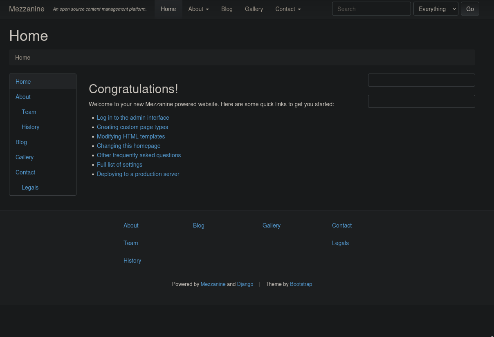
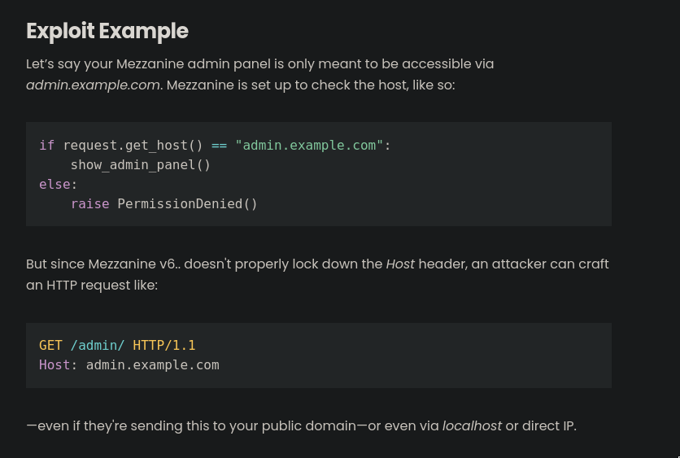
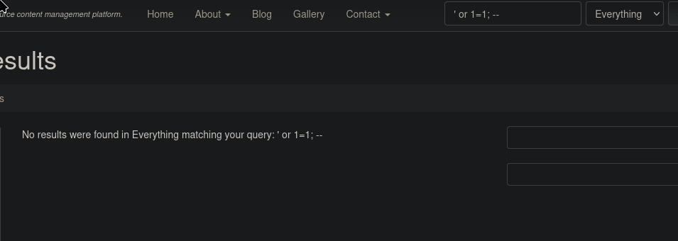
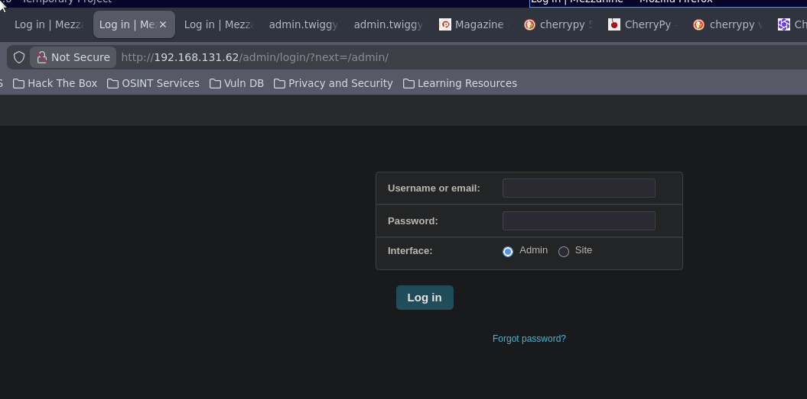
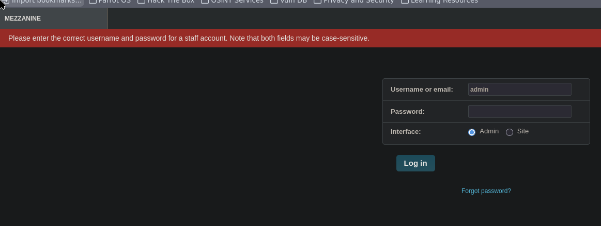
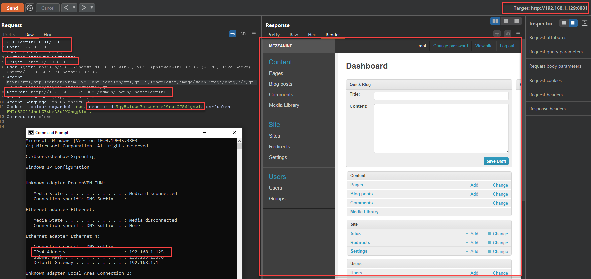
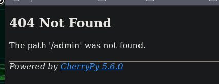
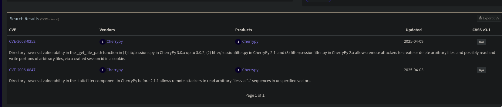

# Twiggy

- **Author:** Julien Bongars
- **Date:** 2026-02-21 20:45:55
- **Path:** /home/julien/.hacklas/targets/track-tjnull/Twiggy

---

link = https://portal.offsec.com/machine/twiggy-244/overview/details
ip =

# Description

In this lab, we will gain access by exploiting a pre-auth remote code execution vulnerability on a SaltStack master. This will allow us to execute commands on the master by creating a runner of salt.cmd using the cmd.exec_code function. This exercise enhances your skills in exploiting vulnerabilities for command execution and system access.

# Port scanning

**nmap**

```bash
nmap -sC -sV -p- -oA "/home/julien/.hacklas/targets/track-tjnull/Twiggy/nmap/full" "$IP_ADDRESS"

# Nmap 7.95 scan initiated Sat Feb 21 21:14:50 2026 as: nmap -sC -sV -vv -oA ./nmap/quick 192.168.131.62
Nmap scan report for 192.168.131.62
Host is up, received syn-ack (0.0072s latency).
Scanned at 2026-02-21 21:14:50 +08 for 24s
Not shown: 996 filtered tcp ports (no-response)
PORT     STATE SERVICE REASON  VERSION
22/tcp   open  ssh     syn-ack OpenSSH 7.4 (protocol 2.0)
| ssh-hostkey: 
|   2048 44:7d:1a:56:9b:68:ae:f5:3b:f6:38:17:73:16:5d:75 (RSA)
| ssh-rsa AAAAB3NzaC1yc2EAAAADAQABAAABAQCZz8rKSxgnT5mqHeBPqGlXFj2JJdq21roV/2M8/+0F5/5D1XsaXmbktDpKILFdBcYnLtPxWstxPq+FTbWAJad2uk3BPYWRxidK2dOozE5rKLCyxtkEqs/lO09pM6VKQUi83y5wMwI+9Akkir0AMruuFUSpeCIBt/L98g8OYxzyTsylQATnPxJrrQOWGUQYAvX6jIs25n6d3rmbXk/crg1ZfAVFEHEeR9Y6Bjc2o5YWjMp3XbOZyC4yYseoM6eH2yCSDwu1DzPYrU6cNMfxBf863w1uyhiFk3eIb5jud3kfoxIq6t5JU2DXNhEd4rdXuuinZUSxWiCpHLZ1FCi4tkX5
|   256 1c:78:9d:83:81:52:f4:b0:1d:8e:32:03:cb:a6:18:93 (ECDSA)
| ecdsa-sha2-nistp256 AAAAE2VjZHNhLXNoYTItbmlzdHAyNTYAAAAIbmlzdHAyNTYAAABBBA1gj1q7mOswnou9RvKwuX8S7WFBhz2NlaSIpYPQmM0I/vqb4T459PgJcMaJOE+WmPiMnDSFsyV3C6YszM754Hc=
|   256 08:c9:12:d9:7b:98:98:c8:b3:99:7a:19:82:2e:a3:ea (ED25519)
|_ssh-ed25519 AAAAC3NzaC1lZDI1NTE5AAAAIBzTSyInONbcDxdYULbDvI/HyrQm9m9M5b6Z825jnBEF
53/tcp   open  domain  syn-ack NLnet Labs NSD
80/tcp   open  http    syn-ack nginx 1.16.1
|_http-favicon: Unknown favicon MD5: 11FB4799192313DD5474A343D9CC0A17
| http-methods: 
|_  Supported Methods: GET HEAD OPTIONS
|_http-title: Home | Mezzanine
|_http-server-header: nginx/1.16.1
8000/tcp open  http    syn-ack nginx 1.16.1
|_http-server-header: nginx/1.16.1
|_http-title: Site doesn't have a title (application/json).
| http-methods: 
|_  Supported Methods: GET HEAD POST OPTIONS
|_http-open-proxy: Proxy might be redirecting requests

Read data files from: /usr/bin/../share/nmap
Service detection performed. Please report any incorrect results at https://nmap.org/submit/ .
# Nmap done at Sat Feb 21 21:15:14 2026 -- 1 IP address (1 host up) scanned in 24.12 seconds
```

## Nmap Full

```bash
# Nmap 7.95 scan initiated Sat Feb 21 22:20:17 2026 as: nmap -sC -sV -vv -oA ./nmap/full -p- -A 192.168.131.62
Nmap scan report for twiggy.offsec (192.168.131.62)
Host is up, received syn-ack (0.0065s latency).
Scanned at 2026-02-21 22:20:17 +08 for 142s
Not shown: 65529 filtered tcp ports (no-response)
PORT     STATE SERVICE REASON  VERSION
22/tcp   open  ssh     syn-ack OpenSSH 7.4 (protocol 2.0)
| ssh-hostkey: 
|   2048 44:7d:1a:56:9b:68:ae:f5:3b:f6:38:17:73:16:5d:75 (RSA)
| ssh-rsa AAAAB3NzaC1yc2EAAAADAQABAAABAQCZz8rKSxgnT5mqHeBPqGlXFj2JJdq21roV/2M8/+0F5/5D1XsaXmbktDpKILFdBcYnLtPxWstxPq+FTbWAJad2uk3BPYWRxidK2dOozE5rKLCyxtkEqs/lO09pM6VKQUi83y5wMwI+9Akkir0AMruuFUSpeCIBt/L98g8OYxzyTsylQATnPxJrrQOWGUQYAvX6jIs25n6d3rmbXk/crg1ZfAVFEHEeR9Y6Bjc2o5YWjMp3XbOZyC4yYseoM6eH2yCSDwu1DzPYrU6cNMfxBf863w1uyhiFk3eIb5jud3kfoxIq6t5JU2DXNhEd4rdXuuinZUSxWiCpHLZ1FCi4tkX5
|   256 1c:78:9d:83:81:52:f4:b0:1d:8e:32:03:cb:a6:18:93 (ECDSA)
| ecdsa-sha2-nistp256 AAAAE2VjZHNhLXNoYTItbmlzdHAyNTYAAAAIbmlzdHAyNTYAAABBBA1gj1q7mOswnou9RvKwuX8S7WFBhz2NlaSIpYPQmM0I/vqb4T459PgJcMaJOE+WmPiMnDSFsyV3C6YszM754Hc=
|   256 08:c9:12:d9:7b:98:98:c8:b3:99:7a:19:82:2e:a3:ea (ED25519)
|_ssh-ed25519 AAAAC3NzaC1lZDI1NTE5AAAAIBzTSyInONbcDxdYULbDvI/HyrQm9m9M5b6Z825jnBEF
53/tcp   open  domain  syn-ack NLnet Labs NSD
80/tcp   open  http    syn-ack nginx 1.16.1
|_http-server-header: nginx/1.16.1
|_http-title: Home | Mezzanine
| http-methods: 
|_  Supported Methods: GET HEAD OPTIONS
|_http-favicon: Unknown favicon MD5: 11FB4799192313DD5474A343D9CC0A17
4505/tcp open  zmtp    syn-ack ZeroMQ ZMTP 2.0
4506/tcp open  zmtp    syn-ack ZeroMQ ZMTP 2.0
8000/tcp open  http    syn-ack nginx 1.16.1
| http-methods: 
|_  Supported Methods: GET HEAD POST OPTIONS
|_http-open-proxy: Proxy might be redirecting requests
|_http-title: Site doesn't have a title (application/json).
|_http-server-header: nginx/1.16.1

Read data files from: /usr/bin/../share/nmap
Service detection performed. Please report any incorrect results at https://nmap.org/submit/ .
# Nmap done at Sat Feb 21 22:22:39 2026 -- 1 IP address (1 host up) scanned in 142.92 seconds
```

# Enumeration

## Web 80

Bannner grab

```txt
* Connected to 192.168.131.62 (192.168.131.62) port 80
* using HTTP/1.x
> GET / HTTP/1.1
> Host: 192.168.131.62
> User-Agent: curl/8.14.1
> Accept: */*
>
* Request completely sent off
< HTTP/1.1 200 OK
< Server: nginx/1.16.1
< Date: Sat, 21 Feb 2026 13:20:48 GMT
< Content-Type: text/html; charset=utf-8
< Content-Length: 6927
< Connection: keep-alive
< X-Frame-Options: SAMEORIGIN
< Vary: Cookie
<
{ [5345 bytes data]
100  692<!doctype html>
```

We see that the website is powered by Mezzanine ond Django



This brings us to this Github: https://github.com/stephenmcd/mezzanine

There is this [CVE-2024-25170](https://www.cve.news/cve-2024-25170/)



Can try to change the vhost maybe to admin.x.com. Problem is I don't know what the DNS is... Maybe DNS service?

trying to do DNS enumeration but think this might be a deadend.

```bash
dig @192.168.131.62 version.bind TXT CHAOS
dig @192.168.131.62 -x 192.168.131.62
dig @192.168.131.62 any .
nmap -sU -p 53 --script dns-nsid 192.168.131.62

# this one requires sudo
nmap -sU -p 53 --script dns-nsid,dns-service-discovery <target_ip>
```



search does not have SQLi vuln as I can see... Of course it wouldn't because it's a COTS..

Found an admin dashboard by clicking around in the links:-



admin:admin does not work



Found another potential CVE but the bulletin is a bit cryptic... it's just this image



## API 8000

Note I'm using twiggy.offsec for convenience but so far I don't believe there a vhost yet.

trying to curl port 8000 I get the following

```bash
┌─[julien@parrot]─[~/.hacklas/targets/track-tjnull/Twiggy]
└──╼ $ curl http://twiggy.offsec:8000 -v
* Host twiggy.offsec:8000 was resolved.
* IPv6: (none)
* IPv4: 192.168.131.62
*   Trying 192.168.131.62:8000...
* Connected to twiggy.offsec (192.168.131.62) port 8000
* using HTTP/1.x
> GET / HTTP/1.1
> Host: twiggy.offsec:8000
> User-Agent: curl/8.14.1
> Accept: */*
>
* Request completely sent off
< HTTP/1.1 200 OK
< Server: nginx/1.16.1
< Date: Sat, 21 Feb 2026 13:44:22 GMT
< Content-Type: application/json
< Content-Length: 146
< Connection: keep-alive
< Access-Control-Expose-Headers: GET, POST
< Vary: Accept-Encoding
< Allow: GET, HEAD, POST
< Access-Control-Allow-Credentials: true
< Access-Control-Allow-Origin: *
< X-Upstream: salt-api/3000-1
<
* Connection #0 to host twiggy.offsec left intact
{"clients": ["local", "local_async", "local_batch", "local_subset", "runner", "runner_async", "ssh", "wheel", "wheel_async"], "return":
 "Welcome"}%
┌─[julien@parrot]─[~/.hacklas/targets/track-tjnull/Twiggy]
└──╼ $
```

Starting a dir buster for the server.

I noticed the 404 page looks like this:-



looking for vulnerabilities on CherryPy, can't seem to find many

link: https://app.opencve.io/cve/?product=cherrypy&vendor=cherrypy



doesn't seem to be exploitable based on version...

feroxbuster came back for port 8000 going to start one for port 80 as well...

```bash
┌─[julien@parrot]─[~]
└──╼ $ feroxbuster -w /usr/share/wordlists/seclists/Discovery/Web-Content/raft-medium-directories-lowercase.txt -u 'http://twiggy.offsec:8000/'

 ___  ___  __   __     __      __         __   ___
|__  |__  |__) |__) | /  `    /  \ \_/ | |  \ |__
|    |___ |  \ |  \ | \__,    \__/ / \ | |__/ |___
by Ben "epi" Risher 🤓                 ver: 2.13.1
───────────────────────────┬──────────────────────
 🎯  Target Url            │ http://twiggy.offsec:8000/
 🚩  In-Scope Url          │ twiggy.offsec
 🚀  Threads               │ 50
 📖  Wordlist              │ /usr/share/wordlists/seclists/Discovery/Web-Content/raft-medium-directories-lowercase.txt
 👌  Status Codes          │ All Status Codes!
 💥  Timeout (secs)        │ 7
 🦡  User-Agent            │ feroxbuster/2.13.1
 💉  Config File           │ /home/julien/.config/feroxbuster/ferox-config.toml
 🔎  Extract Links         │ true
 🏁  HTTP methods          │ [GET]
 🔃  Recursion Depth       │ 4
───────────────────────────┴──────────────────────
 🏁  Press [ENTER] to use the Scan Management Menu™
──────────────────────────────────────────────────
404      GET       30l       61w        -c Auto-filtering found 404-like response and created new filter; toggle off with --dont-filter
200      GET        1l       12w      146c http://twiggy.offsec:8000/
200      GET        1l        6w       43c http://twiggy.offsec:8000/login
500      GET       30l       70w      823c http://twiggy.offsec:8000/logout
200      GET        1l       12w      146c http://twiggy.offsec:8000/index
401      GET       30l       59w      753c http://twiggy.offsec:8000/events
401      GET       30l       59w      753c http://twiggy.offsec:8000/jobs
401      GET       30l       59w      753c http://twiggy.offsec:8000/stats
404      GET       30l       62w      744c http://twiggy.offsec:8000/reports%20list
404      GET       30l       62w      746c http://twiggy.offsec:8000/external%20files
200      GET        1l       12w      146c http://twiggy.offsec:8000/run
401      GET       30l       59w      753c http://twiggy.offsec:8000/keys
404      GET       30l       63w      747c http://twiggy.offsec:8000/neuf%20giga%20photo
401      GET       30l       59w      753c http://twiggy.offsec:8000/hook
500      GET       40l      123w     1455c http://twiggy.offsec:8000/%E2%80%8E
500      GET       40l      123w     1455c http://twiggy.offsec:8000/anv%C3%A4ndare
404      GET       30l       62w      746c http://twiggy.offsec:8000/web%20references
200      GET        1l       12w      146c http://twiggy.offsec:8000/token
404      GET       30l       62w      742c http://twiggy.offsec:8000/contact%20us
500      GET       40l      123w     1455c http://twiggy.offsec:8000/%D7%99%D7%9D
404      GET       30l       62w      743c http://twiggy.offsec:8000/donate%20cash
404      GET       30l       62w      741c http://twiggy.offsec:8000/home%20page
404      GET       30l       62w      746c http://twiggy.offsec:8000/press%20releases
404      GET       30l       62w      740c http://twiggy.offsec:8000/site%20map
500      GET       40l      123w     1455c http://twiggy.offsec:8000/%E9%99%A4%E5%80%99%E9%80%89
500      GET       40l      123w     1455c http://twiggy.offsec:8000/%E4%BE%B5%E6%9D%83
500      GET       40l      123w     1455c http://twiggy.offsec:8000/%E9%99%A4%E6%8A%95%E7%A5%A8
404      GET       30l       62w      744c http://twiggy.offsec:8000/bequest%20gift
500      GET       40l      123w     1455c http://twiggy.offsec:8000/dirk-m%C3%BCller
500      GET       40l      123w     1456c http://twiggy.offsec:8000/thomas-sch%C3%B6ll
404      GET       30l       62w      741c http://twiggy.offsec:8000/gift%20form
404      GET       30l       63w      748c http://twiggy.offsec:8000/life%20income%20gift
404      GET       30l       62w      743c http://twiggy.offsec:8000/site%20assets
500      GET       40l      123w     1455c http://twiggy.offsec:8000/%C4%BC
500      GET       40l      123w     1455c http://twiggy.offsec:8000/%C4%A3%C4%BC
500      GET       40l      123w     1455c http://twiggy.offsec:8000/%CC%A8%C4%BC
500      GET       40l      123w     1455c http://twiggy.offsec:8000/%C5%B1%C4%BC
500      GET       40l      123w     1455c http://twiggy.offsec:8000/%DD%BF%C4%BC
500      GET       40l      123w     1455c http://twiggy.offsec:8000/%E2%80%9D
500      GET       40l      123w     1455c http://twiggy.offsec:8000/%E7%89%B9%E6%AE%8A
500      GET       40l      123w     1455c http://twiggy.offsec:8000/%E8%AE%A8%E8%AE%BA
[####################] - 71s    26607/26607   0s      found:40      errors:20
[####################] - 71s    26584/26584   376/s   http://twiggy.offsec:8000/
┌─[julien@parrot]─[~]
└──╼ $
```

## ZeroMQ 4505 4506

Reading the docs/getting started guide. There is a section for Python: https://zeromq.org/get-started/#?language=python

```py
//  Hello World client
#include <zmq.h>
#include <string.h>
#include <stdio.h>
#include <unistd.h>

int main (void)
{
    printf ("Connecting to hello world server…\n");
    void *context = zmq_ctx_new ();
    void *requester = zmq_socket (context, ZMQ_REQ);
    zmq_connect (requester, "tcp://localhost:5555");

    int request_nbr;
    for (request_nbr = 0; request_nbr != 10; request_nbr++) {
        char buffer [10];
        printf ("Sending Hello %d…\n", request_nbr);
        zmq_send (requester, "Hello", 5, 0);
        zmq_recv (requester, buffer, 10, 0);
        printf ("Received World %d\n", request_nbr);
    }
    zmq_close (requester);
    zmq_ctx_destroy (context);
    return 0;
}
```

---

Taking a break to work on enumeration...

# Creds

-

# References

-
